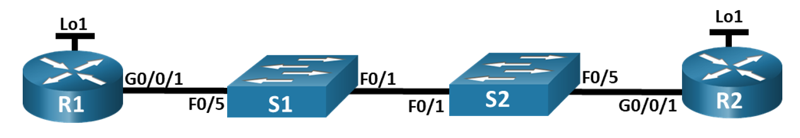
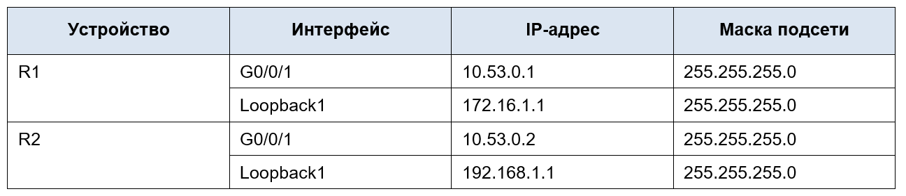

# Лабораторная работа - Настройка протокола OSPFv2 для одной области

## Топология



## Таблица адресации



## Часть 2. Настройка и проверка базовой работы протокола OSPFv2 для одной области

### Шаг 1. Настройте адреса интерфейса и базового OSPFv2 на каждом маршрутизаторе.

```
R1#enable
R1#conf t
Enter configuration commands, one per line. End with CNTL/Z.
R1 (config)#interface g0/0/1
R1(config-if) tip address 10.53.0.1 255.255.255.0
R1(config-if)#no shutdown
R1(config-if)#
*LINK-5-CHANGED: Interface GigabitEthernet0/0/1, changed state to up
* LINE PROTO-5-UPDOWN: Line protocol on Interface GigabitEthernet0/0/1, changed state to up
R1(config-if)#interface loopback 1
Rl (config-if)#
LINK-5-CHANGED: Interface Loopbackl, changed state to up
* LINE PROTO-5-UPDOWN: Line protocol on Interface Loopbackl, changed state to up
R1(config-if)# ip address 172.16.1.1 255.255.255.0
R1 (config-if)#exit
R1 (config)#router ospf 56
R1 (config-router) #router-id 1.1.1.1
R1(config-router) #network 10.53.0.0 0.0.0.255 area 0
R1(config-router) #exit
```

```

R2 #enable
R2#conf t
Enter configuration commands, one per line. End with CNTL/Z.
R2 (config)#interface g0/0/1
R2 (config-if)# ip address 10.53.0.2 255.255.255.0
R2 (config-if)#no shutdown
R2 (config-if)#
*LINK-5-CHANGED: Interface GigabitEthernet0/0/1, changed state to up
*LINEPROTO-5-UPDOWN: Line protocol on Interface GigabitEthernet0/0/1, changed state to up
R2 (config-if)#exit
R2 (config)#interface loopback 1
R2 (config-if)#
LINK-5-CHANGED: Interface Loopbackl, changed state to up
*LINEPROTO-5-UPDOWN: Line protocol on Interface Loopbackl, changed state to up
R2 (config-if)#ip address 192.168.1.1 255.255.255.0
R2 (config-if)#exit
R2 (config)#router ospf 56
R2 (config-router) #router-id 2.2.2.2
R2 (config-router) #network 10.53.0.0 0.0.0.255 area 0
R2 (config-router) #network 192.168.1.0 0.0.0.255 area 0
R2 (config-router) #exirt
01:21:37: OSPF-5-ADJCHG: Process 56, Nbr 1.1.1.1 on GigabitEthernet0/0/1 from LOADING to FULL, Loading Done
Invalid input detected at A marker.
R2 (config-router) #exit
R2 (config)#end
R2#
\SYS-5-CONFIG_I: Configured from console by console
write
Building configuration...
[OK]
R2#
R2# show ip ospf neighbor


Neighbor ID      Pri      State       Dead Time     Address         Interface
1.1.1.1            1      FULL/DR     00:00:39      10.53.0.1       GigabitEthernet0/0/1
```

```
R1#show ip ospf neighbor
Neighbor ID      Pri      State       Dead Time     Address         Interface
2.2.2.2            1      FULL/DR     00:00:30      10.53.0.2       GigabitEthernet0/0/1
```


**Какой маршрутизатор является DR? Какой маршрутизатор является BDR? Каковы критерии отбора?**

R2 - DR, R1 - BDR
Приоритет по интерфейсов умолчанию 1, выбор проходит по RouterID - R2 имеет более высокий RouterID (2.2.2.2) поэтому он становится DR, а R1 - BDR


## Часть 3. Оптимизация и проверка конфигурации OSPFv2 для одной области

### Шаг 1. Реализация различных оптимизаций на каждом маршрутизаторе.


### Шаг 2. Убедитесь, что оптимизация OSPFv2 реализовалась.


**Почему стоимость OSPF для маршрута по умолчанию отличается от стоимости OSPF в R1 для сети 192.168.1.0/24?**

Стоимость отличается потому что сеть 192.168.1.0/24 является внутренним маршрутом OSPF, стоимость которого рассчитывается как сумма стоимостей интерфейсов по пути. Маршрут по умолчанию распространяется как внешний маршрут и по умолчанию получает метрику 1
