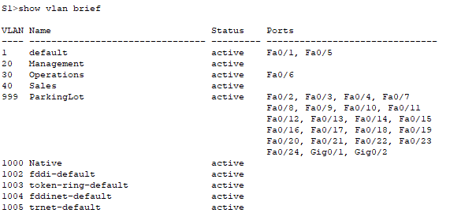
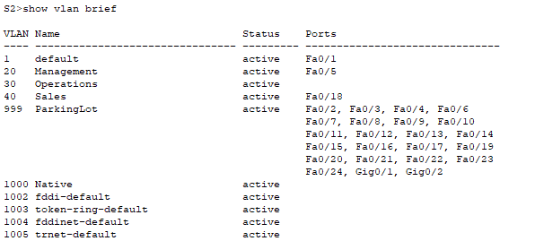

# Лабораторная работа - Настройка и проверка расширенных списков контроля доступа

## Топология


## Таблица адресации


## Таблица VLAN


## Часть 2. Настройка сетей VLAN на коммутаторах.

### Шаг 1. Создайте сети VLAN на коммутаторах.

```
Sl>enable
Sl#conf t
Enter configuration commands, one per line. End with CNTL/2.
S1(config)#vlan 20
S1(config-vlan)#name Management
S1 (config-vlan)#exit
S1 (config)#vlan 30
S1(config-vlan)#name Operations
S1(config-vlan)#exit
S1 (config)#vlan 40 S1(config-vlan)#name Sales S1(config-vlan)#exit S1 (config)#vlan 999
S1 (config-vlan)#name ParkingLot S1(config-vlan)#exit S1 (config) #vlan 1000 S1(config-vlan) #name Native.
S1(config-vlan)#exit
S1 (config)#interface vlan 20
S1(config-if)#
LINK-5-CHANGED: Interface Vlan20, changed state to up

S1(config-if)#ip address 10.20.0.2 255.255.255.0 S1(config-if)#no shut
S1(config-if)#exit
S1 (config)#ip default-gateway 10.20.0.1 S1(config)#interface fa0/6
S1(config-if)# switchport mode access S1(config-if)# switchport access vlan 30
S1 (config-if)#no shutd
S1(config-if)#exit
S1(config)#interface range fa0/2-4, fa0/7-24, gi0/1-2
S1(config-if-range) # switchport mode access
S1(config-if-range) # switchport access vlan 999
S1(config-if-range) # shutdown

 *LINK-5-CHANGED: Interface FastEthernet0/2, changed state to administratively down

 *LINK-5-CHANGED: Interface FastEthernet0/3, changed state to administratively down

 *LINK-5-CHANGED: Interface FastEthernet0/4, changed state to administratively down

 *LINK-5-CHANGED: Interface FastEthernet0/7, changed state to administratively down
```

```
S2>enable
S2#conf t
Enter configuration commands, one per line. End with CNTL/Z.
S2 (config)#vlan 20
S2 (config-vlan)#name Management
S2 (config-vlan)#exit
S2 (config) #vlan 30
S2 (config-vlan)#name Operations
S2 (config-vlan)#exit
S2 (config) #vlan 40
S2 (config-vlan)#name Sales
S2 (config-vlan)#exit
S2 (config)#vlan 999
S2 (config-vlan) #name ParkingLot
S2 (config-vlan)#exit
S2 (config) #vlan 1000
S2 (config-vlan)#name Native
S2 (config-vlan)#exit
S2 (config) #interface vlan 20
S2 (config-if)#
LINK-5-CHANGED: Interface Vlan20, changed state to up

S2 (config-if)#ip address 10.20.0.3 255.255.255.0
S2 (config-if)#no shut
S2 (config-if)#exit
S2 (config)#ip default-gateway 10.20.0.1
S2 (config)#interface fa0/5
S2 (config-if)# switchport mode access
S2 (config-if)# switchport access vlan 20
S2 (config-if)#no shut
S2 (config-if)#exit
S2 (config)#interface fa0/18
S2 (config-if)# switchport mode access
S2 (config-if)# switchport access vlan 40
S2 (config-if)#no shut
S2 (config-if)#exit
S2 (config)#interface range fa0/2-4, fa0/6-17, fa0/19-24, gi0/1-2
S2 (config-if-range) # switchport mode access
S2 (config-if-range) # switchport access vlan 999
S2 (config-if-range) #shutdown

LINK-5-CHANGED: Interface FastEthernet0/2, changed state to administratively down

*LINK-5-CHANGED: Interface FastEthernet0/3, changed state to administratively down
```


### Шаг 2. Назначьте сети VLAN соответствующим интерфейсам коммутатора.





## Часть 3. Настройте транки (магистральные каналы).

### Шаг 1. Вручную настройте магистральный интерфейс F0/1.


### Шаг 2. Вручную настройте магистральный интерфейс F0/5 на коммутаторе S1.


## Часть 4. Настройте маршрутизацию.

### Шаг 1. Настройка маршрутизации между сетями VLAN на R1.


### Шаг 2. Настройка интерфейса R2 g0/0/1 с использованием адреса из таблицы и маршрута по умолчанию с адресом следующего перехода 10.20.0.1


## Часть 5. Настройте удаленный доступ

### Шаг 1. Настройте все сетевые устройства для базовой поддержки SSH.


### Шаг 2. Включите защищенные веб-службы с проверкой подлинности на R1.


В CPT не поддерживается команда ip http

## Часть 6. Проверка подключения

### Шаг 1. Настройте узлы ПК.


### Шаг 2. Выполните следующие тесты. Эхозапрос должен пройти успешно.


В CPT не поддерживается команда ip http, HTTP/S сервер недоступен

## Часть 7. Настройка и проверка списков контроля доступа (ACL)

### Политика 1 — запрет SSH в Management


### Политика 2 — запрет HTTP/HTTPS в Management


### Политика 3 — запрет ping в Operations и Management


### Политика 4 — запрет ICMP в Sales


### Проверка ACL


