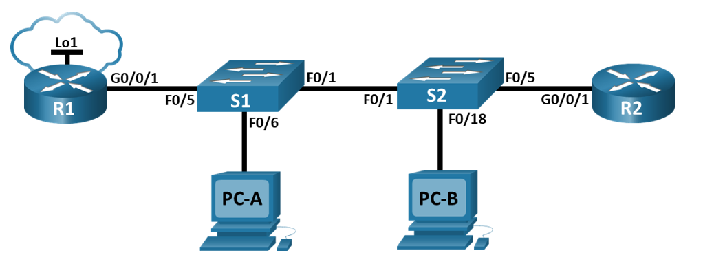
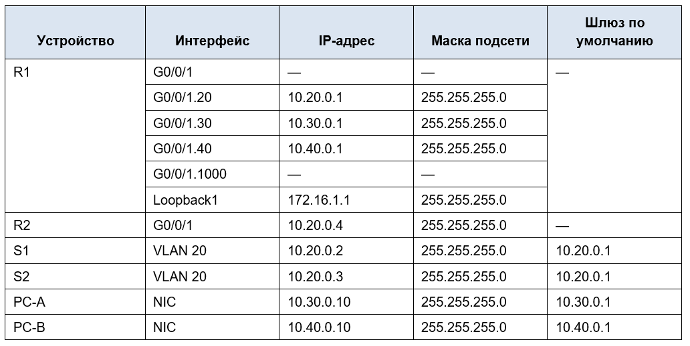
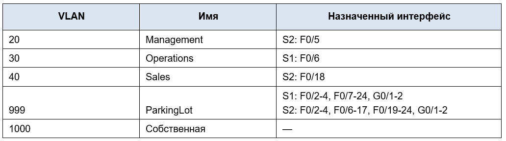
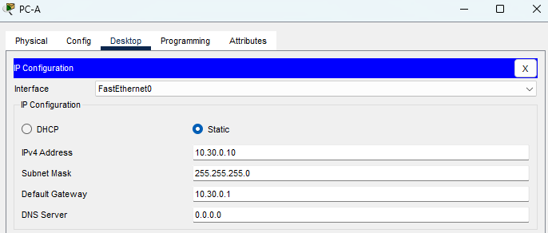
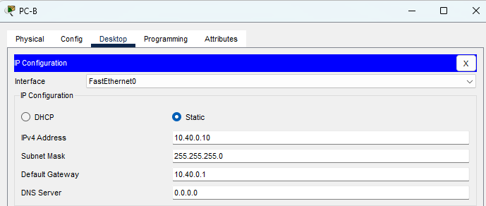
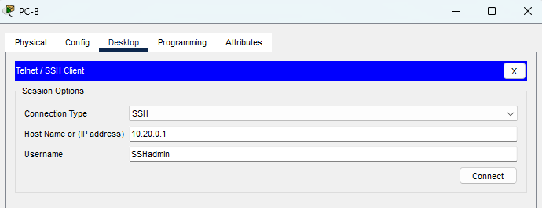
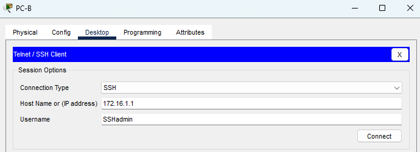
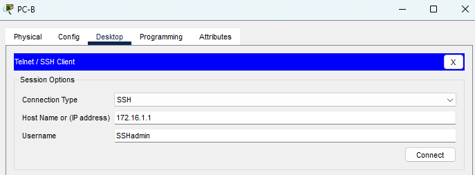

# Лабораторная работа - Настройка и проверка расширенных списков контроля доступа

## Топология



## Таблица адресации



## Таблица VLAN



## Часть 2. Настройка сетей VLAN на коммутаторах.

### Шаг 1. Создайте сети VLAN на коммутаторах.

```
S1>enable
S1#conf t
Enter configuration commands, one per line.  End with CNTL/Z.
S1(config)#vlan 20
S1(config-vlan)#name Management
S1(config-vlan)#exit
S1(config)#vlan 30
S1(config-vlan)#name Operations
S1(config-vlan)#exit
S1(config)#vlan 40
S1(config-vlan)#name Sales
S1(config-vlan)#exit
S1(config)#vlan 999
S1(config-vlan)#name ParkingLot
S1(config-vlan)#exit
S1(config)#vlan 1000
S1(config-vlan)#name Native
S1(config-vlan)#exit
S1(config)#interface vlan 20
%LINK-5-CHANGED: Interface Vlan20, changed state to up
S1(config-if)#ip address 10.20.0.2 255.255.255.0
S1(config-if)#no shut
S1(config-if)#exit
S1(config)#ip default-gateway 10.20.0.1
S1(config)#interface fa0/6
S1(config-if)#switchport mode access
S1(config-if)#switchport access vlan 30
S1(config-if)#no shutd
S1(config-if)#exit
S1(config)#interface range fa0/2-4, fa0/7-24, gi0/1-2
S1(config-if-range)#switchport mode access
S1(config-if-range)#switchport access vlan 999
S1(config-if-range)#shutdown
%LINK-5-CHANGED: Interface FastEthernet0/2, changed state to administratively down
%LINK-5-CHANGED: Interface FastEthernet0/3, changed state to administratively down
%LINK-5-CHANGED: Interface FastEthernet0/4, changed state to administratively down
%LINK-5-CHANGED: Interface FastEthernet0/7, changed state to administratively down
```

```
S2>enable
S2#conf t
Enter configuration commands, one per line.  End with CNTL/Z.
S2(config)#vlan 20
S2(config-vlan)#name Management
S2(config-vlan)#exit
S2(config)#vlan 30
S2(config-vlan)#name Operations
S2(config-vlan)#exit
S2(config)#vlan 40
S2(config-vlan)#name Sales
S2(config-vlan)#exit
S2(config)#vlan 999
S2(config-vlan)#name ParkingLot
S2(config-vlan)#exit
S2(config)#vlan 1000
S2(config-vlan)#name Native
S2(config-vlan)#exit
S2(config)#interface vlan 20
%LINK-5-CHANGED: Interface Vlan20, changed state to up
S2(config-if)#ip address 10.20.0.3 255.255.255.0
S2(config-if)#no shut
S2(config-if)#exit
S2(config)#ip default-gateway 10.20.0.1
S2(config)#interface fa0/5
S2(config-if)#switchport mode access
S2(config-if)#switchport access vlan 20
S2(config-if)#no shut
S2(config-if)#exit
S2(config)#interface fa0/18
S2(config-if)#switchport mode access
S2(config-if)#switchport access vlan 40
S2(config-if)#no shut
S2(config-if)#exit
S2(config)#interface range fa0/2-4, fa0/6-17, fa0/19-24, gi0/1-2
S2(config-if-range)#switchport mode access
S2(config-if-range)#switchport access vlan 999
S2(config-if-range)#shutdown
%LINK-5-CHANGED: Interface FastEthernet0/2, changed state to administratively down
%LINK-5-CHANGED: Interface FastEthernet0/3, changed state to administratively down
```

### Шаг 2. Назначьте сети VLAN соответствующим интерфейсам коммутатора.

```
S1>show vlan brief

VLAN  Name                             Status    Ports
----  --------------------------------  --------- -------------------------------
1     default                          active    Fa0/1, Fa0/5
20    Management                        active    
30    Operations                        active    Fa0/6
40    Sales                             active    
999   ParkingLot                        active    Fa0/2, Fa0/3, Fa0/4, Fa0/7
                                                  Fa0/8, Fa0/9, Fa0/10, Fa0/11
                                                  Fa0/12, Fa0/13, Fa0/14, Fa0/15
                                                  Fa0/16, Fa0/17, Fa0/18, Fa0/19
                                                  Fa0/20, Fa0/21, Fa0/22, Fa0/23
1000  Native                            active    Fa0/24, Gig0/1, Gig0/2
1002  fddi-default                      active    
1003  token-ring-default                active    
1004  fddinet-default                   active    
1005  trnet-default                     active    
```

```
S2>show vlan brief

VLAN  Name                             Status    Ports
----  --------------------------------  --------- -------------------------------
1     default                          active    Fa0/1
20    Management                        active    Fa0/5
30    Operations                        active    
40    Sales                             active    Fa0/18
999   ParkingLot                        active    Fa0/2, Fa0/3, Fa0/4, Fa0/6
                                                  Fa0/7, Fa0/8, Fa0/9, Fa0/10
                                                  Fa0/11, Fa0/12, Fa0/13, Fa0/14
                                                  Fa0/15, Fa0/16, Fa0/17, Fa0/19
                                                  Fa0/20, Fa0/21, Fa0/22, Fa0/23
1000  Native                            active    Fa0/24, Gig0/1, Gig0/2
1002  fddi-default                      active    
1003  token-ring-default                active    
1004  fddinet-default                   active    
1005  trnet-default                     active    
```

## Часть 3. Настройте транки (магистральные каналы).

### Шаг 1. Вручную настройте магистральный интерфейс F0/1.

```
S1>enable
S1#conf t
Enter configuration commands, one per line.  End with CNTL/Z.
S1(config)#interface fa0/1
S1(config-if)#switchport mode trunk
S1(config-if)#
%LINEPROTO-5-UPDOWN: Line protocol on Interface FastEthernet0/1, changed state to down
%LINEPROTO-5-UPDOWN: Line protocol on Interface FastEthernet0/1, changed state to up
%LINEPROTO-5-UPDOWN: Line protocol on Interface Vlan20, changed state to up
S1(config-if)#switchport trunk native vlan 1000
S1(config-if)#switchport trunk allowed vlan 20,30,40,1000
S1(config-if)#no shut
S1(config-if)#
%CDP-4-NATIVE_VLAN_MISMATCH: Native VLAN mismatch discovered on FastEthernet0/1 (1000), with S2 FastEthernet0/1 (1).
exit
S1(config)#
%SPANTREE-2-RECV_PVID_ERR: Received BPDU with inconsistent peer vlan id 1 on FastEthernet0/1 VLAN1000.
%SPANTREE-2-BLOCK_PVID_LOCAL: Blocking FastEthernet0/1 on VLAN1000. Inconsistent local vlan.
end
S1#
%SYS-5-CONFIG_I: Configured from console by console
```

```
S2>
S2>enable
S2#conf t
Enter configuration commands, one per line.  End with CNTL/Z.
S2(config)#interface fa0/1
S2(config-if)#switchport mode trunk
S2(config-if)#switchport trunk native vlan 1000
S2(config-if)#switchport trunk allowed vlan 20,30,40,1000
S2(config-if)#no shut
S2(config-if)#exit
```

```
S1#show interfaces trunk

Port      Mode      Encapsulation      Status      Native vlan
Fa0/1     on        802.1q             trunking    1000

Port      Vlans allowed on trunk
Fa0/1     20,30,40,1000

Port      Vlans allowed and active in management domain
Fa0/1     20,30,40,1000

Port      Vlans in spanning tree forwarding state and not pruned
Fa0/1     20,30,40,1000
```

```
S2#show interfaces trunk

Port      Mode      Encapsulation      Status      Native vlan
Fa0/1     on        802.1q             trunking    1000

Port      Vlans allowed on trunk
Fa0/1     20,30,40,1000

Port      Vlans allowed and active in management domain
Fa0/1     20,30,40,1000

Port      Vlans in spanning tree forwarding state and not pruned
Fa0/1     20,30,40,1000
```

### Шаг 2. Вручную настройте магистральный интерфейс F0/5 на коммутаторе S1.

```
S1>enable
S1#conf t
Enter configuration commands, one per line.  End with CNTL/Z.
S1(config)#interface fa0/5
S1(config-if)#switchport mode trunk
S1(config-if)#switchport trunk native vlan 1000
S1(config-if)#switchport trunk allowed vlan 20,30,40,1000
S1(config-if)#no shut
S1(config-if)#exit
S1(config)#end
S1#
%SYS-5-CONFIG_I: Configured from console by console
S1#copy running-config startup-config
Destination filename [startup-config]? 
Building configuration...
[OK]
S1#show interfaces trunk

Port      Mode      Encapsulation      Status      Native vlan
Fa0/1     on        802.1q             trunking    1000

Port      Vlans allowed on trunk
Fa0/1     20,30,40,1000

Port      Vlans allowed and active in management domain
Fa0/1     20,30,40,1000

Port      Vlans in spanning tree forwarding state and not pruned
Fa0/1     20,30,40,1000
```

## Часть 4. Настройте маршрутизацию.

### Шаг 1. Настройка маршрутизации между сетями VLAN на R1.

```
R1>enable
R1#conf t
Enter configuration commands, one per line.  End with CNTL/Z.
R1(config)#interface g0/0/1
R1(config-if)#no shut
%LINK-5-CHANGED: Interface GigabitEthernet0/0/1, changed state to up
%LINEPROTO-5-UPDOWN: Line protocol on Interface GigabitEthernet0/0/1, changed state to up
R1(config-if)#exit
R1(config)#interface g0/0/1.20
%LINK-5-CHANGED: Interface GigabitEthernet0/0/1.20, changed state to up
%LINEPROTO-5-UPDOWN: Line protocol on Interface GigabitEthernet0/0/1.20, changed state to up
R1(config-subif)#encapsulation dot1Q 20
R1(config-subif)#ip address 10.20.0.1 255.255.255.0
R1(config-subif)#exit
R1(config)#interface g0/0/1.30
%LINK-5-CHANGED: Interface GigabitEthernet0/0/1.30, changed state to up
%LINEPROTO-5-UPDOWN: Line protocol on Interface GigabitEthernet0/0/1.30, changed state to up
R1(config-subif)#encapsulation dot1Q 30
R1(config-subif)#ip address 10.30.0.1 255.255.255.0
R1(config-subif)#exit
R1(config)#interface g0/0/1.40
%LINK-5-CHANGED: Interface GigabitEthernet0/0/1.40, changed state to up
%LINEPROTO-5-UPDOWN: Line protocol on Interface GigabitEthernet0/0/1.40, changed state to up
R1(config-subif)#encapsulation dot1Q 40
R1(config-subif)#ip address 10.40.0.1 255.255.255.0
R1(config-subif)#exit
R1(config)#interface g0/0/1.1000
%LINK-5-CHANGED: Interface GigabitEthernet0/0/1.1000, changed state to up
%LINEPROTO-5-UPDOWN: Line protocol on Interface GigabitEthernet0/0/1.1000, changed state to up
R1(config-subif)#encapsulation dot1Q 1000 native
R1(config-subif)#exit
R1(config)#interface loopback 1
%LINK-5-CHANGED: Interface Loopback1, changed state to up
%LINEPROTO-5-UPDOWN: Line protocol on Interface Loopback1, changed state to up
R1(config-if)#ip address 172.16.1.1 255.255.255.0
R1(config-if)#exit
R1(config)#end
R1#
```

```
R1#show ip interface brief

Interface                  IP-Address      OK? Method  Status                Protocol
GigabitEthernet0/0/0         unassigned      YES unset   administratively down down
GigabitEthernet0/0/1         unassigned      YES unset   up                    up
GigabitEthernet0/0/1.20      10.20.0.1       YES manual  up                    up
GigabitEthernet0/0/1.30      10.30.0.1       YES manual  up                    up
GigabitEthernet0/0/1.40      10.40.0.1       YES manual  up                    up
GigabitEthernet0/0/1.1000    unassigned      YES unset   up                    up
Loopback1                    172.16.1.1      YES manual  up                    up
Vlan1                        unassigned      YES unset   administratively down down
```

### Шаг 2. Настройка интерфейса R2 g0/0/1 с использованием адреса из таблицы и маршрута по умолчанию с адресом следующего перехода 10.20.0.1

```
R2>enable
R2#conf t
Enter configuration commands, one per line.  End with CNTL/Z.
R2(config)#interface g0/0/1
R2(config-if)#ip address 10.20.0.4 255.255.255.0
R2(config-if)#no shut
%LINK-5-CHANGED: Interface GigabitEthernet0/0/1, changed state to up
%LINEPROTO-5-UPDOWN: Line protocol on Interface GigabitEthernet0/0/1, changed state to up
R2(config-if)#exit
R2(config)#ip route 0.0.0.0 0.0.0.0 10.20.0.1
R2(config)#end
R2#
%SYS-5-CONFIG_I: Configured from console by console
R2#copy running-config startup-config
Destination filename [startup-config]? 
Building configuration...
[OK]
```

## Часть 5. Настройте удаленный доступ

### Шаг 1. Настройте все сетевые устройства для базовой поддержки SSH.

```
R1>enable
R1#conf t
Enter configuration commands, one per line.  End with CNTL/Z.
R1(config)#username SSHadmin secret \$ciscol23!
R1(config)#ip domain-name ccna-lab.com
R1(config)#crypto key generate rsa
The name for the keys will be: R1.ccna-lab.com
Choose the size of the key modulus in the range of 360 to 4096 for your
General Purpose Keys. Choosing a key modulus greater than 512 may take
a few minutes.
How many bits in the modulus: 1024
Generating 1024 bit RSA keys, keys will be non-exportable...[OK]
R1(config)#ip ssh version 2
*Mar 1 3:14:44.28: SSH-5-ENABLED: SSH 1.99 has been enabled
R1(config)#line vty 0 4
R1(config-line)#login local
R1(config-line)#transport input ssh
R1(config-line)#exit
R1(config)#end
R1#
%SYS-5-CONFIG_I: Configured from console by console
R1#copy running-config startup-config
Destination filename [startup-config]? 
Building configuration...
[OK]
```

```
S1>enable
S1#conf t
Enter configuration commands, one per line.  End with CNTL/Z.
S1(config)#username SSHadmin secret \$ciscol23!
S1(config)#ip domain-name ccna-lab.com
S1(config)#crypto key generate rsa
The name for the keys will be: S1.ccna-lab.com
Choose the size of the key modulus in the range of 360 to 4096 for your
General Purpose Keys. Choosing a key modulus greater than 512 may take
a few minutes.
How many bits in the modulus: 1024
Generating 1024 bit RSA keys, keys will be non-exportable...[OK]
S1(config)#ip ssh version 2
*Mar 1 3:16:41.302: %SSH-5-ENABLED: SSH 1.99 has been enabled
S1(config)#line vty 0 4
S1(config-line)#login local
S1(config-line)#transport input ssh
S1(config-line)#exit
S1(config)#end
S1#
%SYS-5-CONFIG_I: Configured from console by console
S1#copy running-config startup-config
Destination filename [startup-config]? 
Building configuration...
[OK]
```

```
R2>enable
R2#conf t
Enter configuration commands, one per line.  End with CNTL/Z.
R2(config)#username SSHadmin secret \$ciscol23!
R2(config)#ip domain-name ccna-lab.com
R2(config)#crypto key generate rsa
The name for the keys will be: R2.ccna-lab.com
Choose the size of the key modulus in the range of 360 to 4096 for your
General Purpose Keys. Choosing a key modulus greater than 512 may take
a few minutes.
How many bits in the modulus: 1024
Generating 1024 bit RSA keys, keys will be non-exportable...[OK]
R2(config)#ip ssh version 2
*Mar 1 3:19:30.6: %SSH-5-ENABLED: SSH 1.99 has been enabled
R2(config)#line vty 0 4
R2(config-line)#login local
R2(config-line)#transport input ssh
R2(config-line)#exit
R2(config)#end
R2#
%SYS-5-CONFIG_I: Configured from console by console
R2#copy running-config startup-config
Destination filename [startup-config]? 
Building configuration...
[OK]
```

```
S2>enable
S2#conf t
Enter configuration commands, one per line.  End with CNTL/Z.
S2(config)#username SSHadmin secret \$ciscol23!
S2(config)#ip domain-name ccna-lab.com
S2(config)#crypto key generate rsa
The name for the keys will be: S2.ccna-lab.com
Choose the size of the key modulus in the range of 360 to 4096 for your
General Purpose Keys. Choosing a key modulus greater than 512 may take
a few minutes.
How many bits in the modulus: 1024
Generating 1024 bit RSA keys, keys will be non-exportable...[OK]
S2(config)#ip ssh version 2
*Mar 1 3:18:10.132: %SSH-5-ENABLED: SSH 1.99 has been enabled
S2(config)#line vty 0 4
S2(config-line)#login local
S2(config-line)#transport input ssh
S2(config-line)#exit
S2(config)#end
S2#
%SYS-5-CONFIG_I: Configured from console by console
S2#copy running-config startup-config
Destination filename [startup-config]? 
Building configuration...
[OK]
```

### Шаг 2. Включите защищенные веб-службы с проверкой подлинности на R1.

```
R1>enable
R1#conf t
Enter configuration commands, one per line.  End with CNTL/Z.
R1(config)#ip ?
  access-list          Named access-list
  cef                  Cisco Express Forwarding
  default-gateway      Specify default gateway (if not routing IP)
  default-network      Flags networks as candidates for default routes
  dhcp                 Configure DHCP server and relay parameters
  domain               IP DNS Resolver
  domain-lookup        Enable IP Domain Name System hostname translation
  domain-name          Define the default domain name
  flow-export          Specify host/port to send flow statistics
  forward-protocol     Controls forwarding of physical and directed IP broadcasts
  ftp                  FTP configuration commands
  host                 Add an entry to the ip hostname table
  inspect              Context-based Access Control Engine
  ips                  Intrusion Prevention System
  local                Specify local options
  name-server          Specify address of name server to use
  nat                  NAT configuration commands
  route                Establish static routes
  routing              Enable IP routing
  scp                  Scp commands
  ssh                  Configure ssh options
  tcp                  Global TCP parameters
```

В CPT не поддерживается команда ip http

## Часть 6. Проверка подключения

### Шаг 1. Настройте узлы ПК.





### Шаг 2. Выполните следующие тесты. Эхозапрос должен пройти успешно.

```
C:\>ping 10.40.0.10

Pinging 10.40.0.10 with 32 bytes of data:

Request timed out.
Reply from 10.40.0.10: bytes=32 time<1ms TTL=127
Reply from 10.40.0.10: bytes=32 time<1ms TTL=127
Reply from 10.40.0.10: bytes=32 time<1ms TTL=127

Ping statistics for 10.40.0.10:
    Packets: Sent = 4, Received = 3, Lost = 1 (25% loss),
    Approximate round trip times in milli-seconds:
        Minimum = 0ms, Maximum = 0ms, Average = 0ms

C:\>ping 10.20.0.1

Pinging 10.20.0.1 with 32 bytes of data:

Reply from 10.20.0.1: bytes=32 time<1ms TTL=255
Reply from 10.20.0.1: bytes=32 time<1ms TTL=255
Reply from 10.20.0.1: bytes=32 time<1ms TTL=255
Reply from 10.20.0.1: bytes=32 time<1ms TTL=255

Ping statistics for 10.20.0.1:
    Packets: Sent = 4, Received = 4, Lost = 0 (0% loss),
    Approximate round trip times in milli-seconds:
        Minimum = 1ms, Average = 0ms
```

```
C:\>ping 10.30.0.10

Pinging 10.30.0.10 with 32 bytes of data:

Reply from 10.30.0.10: bytes=32 time<1ms TTL=127
Reply from 10.30.0.10: bytes=32 time<1ms TTL=127
Reply from 10.30.0.10: bytes=32 time<1ms TTL=127
Reply from 10.30.0.10: bytes=32 time<1ms TTL=127

Ping statistics for 10.30.0.10:
    Packets: Sent = 4, Received = 4, Lost = 0 (0% loss),
    Approximate round trip times in milli-seconds:
        Minimum = 0ms, Maximum = 0ms, Average = 0ms

C:\>ping 10.20.0.1

Pinging 10.20.0.1 with 32 bytes of data:

Reply from 10.20.0.1: bytes=32 time<1ms TTL=255
Reply from 10.20.0.1: bytes=32 time<1ms TTL=255
Reply from 10.20.0.1: bytes=32 time=4ms TTL=255
Reply from 10.20.0.1: bytes=32 time<1ms TTL=255

Ping statistics for 10.20.0.1:
    Packets: Sent = 4, Received = 4, Lost = 0 (0% loss),
    Approximate round trip times in milli-seconds:
        Minimum = 0ms, Maximum = 4ms, Average = 1ms

C:\>ping 172.16.1.1

Pinging 172.16.1.1 with 32 bytes of data:

Reply from 172.16.1.1: bytes=32 time<1ms TTL=255
Reply from 172.16.1.1: bytes=32 time<1ms TTL=255
Reply from 172.16.1.1: bytes=32 time<1ms TTL=255
Reply from 172.16.1.1: bytes=32 time=2ms TTL=255

Ping statistics for 172.16.1.1:
    Packets: Sent = 4, Received = 4, Lost = 0 (0% loss),
    Approximate round trip times in milli-seconds:
        Minimum = 0ms, Maximum = 2ms, Average = 0ms
```



```
Password:


R1>
```



```
Password:


R1>
```

В CPT не поддерживается команда ip http, HTTP/S сервер недоступен

## Часть 7. Настройка и проверка списков контроля доступа (ACL)

### Политика 1 — запрет SSH в Management

```
R1>enable
R1#conf t
Enter configuration commands, one per line.  End with CNTL/Z.
R1(config)#ip access-list extended SALES-IN
R1(config-ext-nacl)#deny tcp 10.40.0.0 0.0.0.255 10.20.0.0 0.0.0.255 eq 22
```

### Политика 2 — запрет HTTP/HTTPS в Management

```
R1(config-ext-nacl)#deny tcp 10.40.0.0 0.0.0.255 10.20.0.0 0.0.0.255 eq 80
R1(config-ext-nacl)#deny tcp 10.40.0.0 0.0.0.255 10.20.0.0 0.0.0.255 eq 443
R1(config-ext-nacl)#deny tcp 10.40.0.0 0.0.0.255 host 10.30.0.1 eq 80
R1(config-ext-nacl)#deny tcp 10.40.0.0 0.0.0.255 host 10.30.0.1 eq 443
R1(config-ext-nacl)#deny tcp 10.40.0.0 0.0.0.255 host 10.40.0.1 eq 80
R1(config-ext-nacl)#deny tcp 10.40.0.0 0.0.0.255 host 10.40.0.1 eq 443
```

### Политика 3 — запрет ping в Operations и Management

```
R1(config-ext-nacl)#deny icmp 10.40.0.0 0.0.0.255 10.30.0.0 0.0.0.255 echo
R1(config-ext-nacl)#deny icmp 10.40.0.0 0.0.0.255 10.20.0.0 0.0.0.255 echo
R1(config-ext-nacl)#permit ip 10.40.0.0 0.0.0.255 any
R1(config-ext-nacl)#exit
R1(config)#interface g0/0/1.40
R1(config-subif)#ip access-group SALES-IN in
R1(config-subif)#exit
```

### Политика 4 — запрет ICMP в Sales

```
R1(config)#ip access-list extended OPERATIONS-IN
R1(config-ext-nacl)#deny icmp 10.30.0.0 0.0.0.255 10.40.0.0 0.0.0.255 echo
R1(config-ext-nacl)#permit ip 10.30.0.0 0.0.0.255 any
R1(config-ext-nacl)#exit
R1(config)#interface g0/0/1.30
R1(config-subif)#ip access-group OPERATIONS-IN in
R1(config-subif)#exit
R1(config)#end
```

### Проверка ACL

###PC-A

```
C:\>ping 10.40.0.10

Pinging 10.40.0.10 with 32 bytes of data:

Reply from 10.30.0.1: Destination host unreachable.
Reply from 10.30.0.1: Destination host unreachable.
Reply from 10.30.0.1: Destination host unreachable.
Reply from 10.30.0.1: Destination host unreachable.

Ping statistics for 10.40.0.10:
    Packets: Sent = 4, Received = 0, Lost = 4 (100% loss),

C:\>ping 10.20.0.1

Pinging 10.20.0.1 with 32 bytes of data:

Reply from 10.20.0.1: bytes=32 time<1ms TTL=255
Reply from 10.20.0.1: bytes=32 time<1ms TTL=255
Reply from 10.20.0.1: bytes=32 time<1ms TTL=255
Reply from 10.20.0.1: bytes=32 time<1ms TTL=255

Ping statistics for 10.20.0.1:
    Packets: Sent = 4, Received = 4, Lost = 0 (0% loss),
    Approximate round trip times in milli-seconds:
        Minimum = 0ms, Maximum = 0ms, Average = 0ms
```

###PC-B

```
C:\>ping 10.30.0.10

Pinging 10.30.0.10 with 32 bytes of data:

Reply from 10.40.0.1: Destination host unreachable.
Reply from 10.40.0.1: Destination host unreachable.
Reply from 10.40.0.1: Destination host unreachable.
Reply from 10.40.0.1: Destination host unreachable.

Ping statistics for 10.30.0.10:
    Packets: Sent = 4, Received = 0, Lost = 4 (100% loss),

C:\>ping 10.20.0.1

Pinging 10.20.0.1 with 32 bytes of data:

Reply from 10.40.0.1: Destination host unreachable.
Reply from 10.40.0.1: Destination host unreachable.
Reply from 10.40.0.1: Destination host unreachable.
Reply from 10.40.0.1: Destination host unreachable.

Ping statistics for 10.20.0.1:
    Packets: Sent = 4, Received = 0, Lost = 4 (100% loss),

C:\>ping 172.16.1.1

Pinging 172.16.1.1 with 32 bytes of data:

Reply from 172.16.1.1: bytes=32 time<1ms TTL=255
Reply from 172.16.1.1: bytes=32 time<1ms TTL=255
Reply from 172.16.1.1: bytes=32 time<1ms TTL=255
Reply from 172.16.1.1: bytes=32 time<1ms TTL=255

Ping statistics for 172.16.1.1:
    Packets: Sent = 4, Received = 4, Lost = 0 (0% loss),
    Approximate round trip times in milli-seconds:
        Minimum = 0ms, Maximum = 1ms, Average = 0ms
```




```
Password:


R1>
```
