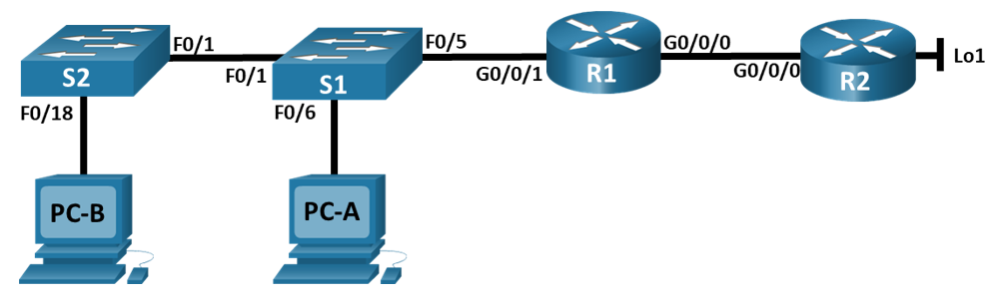

# Лабораторная работа - Настройка NAT для IPv4

## Топология



## Таблица адресации


## Часть 1. Создание сети и настройка основных параметров устройства

### Шаг 2. Произведите базовую настройку маршрутизаторов.

```
R1>enable
R1#conf t
Enter configuration commands, one per line. End with CNTL/Z.
R1 (config)#interface g0/0/0
R1(config-if)#ip address 209.165.200.230 255.255.255.248 R1(config-if)#no shutdown
R1 (config-if)#
*LINK-5-CHANGED: Interface GigabitEthernet0/0/0, changed state to up
R1(config-if)#exit
R1 (config)#interface g0/0/1
R1(config-if)#ip address 192.168.1.1 255.255.255.0
R1 (config-if)#no shutdown
R1(config-if)#
LINK-5-CHANGED: Interface GigabitEthernet0/0/1, changed state to up
& LINEPROTO-5-UPDOWN: Line protocol on Interface GigabitEthernet0/0/1, changed state to up
R1(config-if)#exit
R1 (config) #exnd
Invalid input detected at
R1 (config) #end
R1#
marker.
SYS-5-CONFIG_I: Configured from console by console
R1#copy running-config startup-config Destination filename [startup-config)?
Building configuration...
[OK]
R1#
```

```
R2>enable
R2#conf t
Enter
configuration commands, one per line. End with CNTL/Z.
R2 (config)#interface g0/0/0
R2 (config-if)#ip address 209.165.200.225 255.255.255.248
R2 (config-if)#no shutdown
R2 (config-if)#
LINK-5-CHANGED: Interface GigabitEthernet0/0/0, changed state to up
* LINEPROTO-5-UPDOWN: Line protocol on Interface GigabitEthernet0/0/0, changed state to up
R2 (config-if)#exit
R2 (config)#interface Lol
R2 (config-if)#
LINK-5-CHANGED: Interface Loopbackl, changed state to up
* LINEPROTO-5-UPDOWN: Line protocol on Interface Loopbackl, changed state to up
R2 (config-if)#ip address 209.165.200.1 255.255.255.224
R2 (config-if)#exit
R2 (config)#ip route 0.0.0.0 0.0.0.0 209.165.200.230 R2 (config)#end
R2#
\SYS-5-CONFIG_I: Configured from console by console
R2#copy running-config startup-config Destination filename [startup-config)? Building configuration...
[OK]
R2#
```

### Шаг 3. Настройте базовые параметры каждого коммутатора.

```
Sl>enable
Sl#conf t
Enter configuration commands, one per line. End with CNTL/Z. S1 (config)#interface vlan 1
S1 (config-if)#ip address 192.168.1.11 255.255.255.0
S1(config-if)#no shut
S1(config-if)#
LINK-5-CHANGED: Interface Vlanl, changed state to up
* LINEPROTO-5-UPDOWN: Line protocol on Interface Vlanl, changed state to up
S1(config-if)#exit
S1 (config)#interface range fa0/2-4, fa0/7-24, gi0/1-2
S1(config-if-range) # shutdown
```

```
S2>enable
S2#conf t
Enter configuration commands, one per line. End with CNTL/2. S2 (config)#interface vlan 1
S2 (config-if)# ip address 192.168.1.12 255.255.255.0
S2 (config-if)#no shut
S2 (config-if)#
LINK-5-CHANGED: Interface Vlanl, changed state to up
* LINEPROTO-5-UPDOWN: Line protocol on Interface Vlanl, changed state to up
S2 (config-if)#exit
S2 (config)#interface range fa0/2-17, fa0/19-24, gi0/1-2
S2 (config-if-range) #shutdown
```

## Часть 2. Настройка и проверка NAT для IPv4.

### Шаг 1. Настройте NAT на R1, используя пул из трех адресов 209.165.200.226-209.165.200.228. 

```
R1>enable
R1#conf t
Enter configuration commands, one per line. End with CNTL/Z.
R1 (config)#access-list 1 permit 192.168.1.0 0.0.0.255
R1(config)#ip nat pool PUBLIC ACCESS 209.165.200.226 209.165.200.228 netmask 255.255.255.248
R1 (config)#ip nat inside source list 1 pool PUBLIC ACCESS
R1 (config)#interface g0/0/1 R1(config-if)#ip nat inside. R1 (config-if)#exit
R1 (config)#interface g0/0/0 R1 (config-if)#ip nat outside R1(config-if)#exit
R1 (config)#copy running-config startup-config
Invalid input detected at
marker.
R1 (config)#exit
R1#
SYS-5-CONFIG_I: Configured from console by console
R1#copy running-config startup-config Destination filename [startup-config]? Building configuration....
[OK]
R1#
```

### Шаг 2. Проверьте и проверьте конфигурацию. 

Пререквизит к выполнению - добавить маршрут по умолчанию на R1 до R2, иначе ping с PC-B не пройдет - ip route 0.0.0.0 0.0.0.0 209.165.200.225

```
C:\>ping 209.165.200.1

Pinging 209.165.200.1 with 32 bytes of data:

Reply from 209.165.200.1: bytes=32 time<lms TTL=254
Reply from 209.165.200.1: bytes=32 time<lms TTL-254
Reply from 209.165.200.1: bytes=32 time<lms TTL=254
Reply from 209.165.200.1: bytes=32 time<lms TTL=254

Ping statistics for 209.165.200.1:
     Packets: Sent = 4, Received 4, Lost = 0 (0% loss),
Approximate round trip times in milli-seconds:
     Minimum Oms, Maximum Oms, Average = Oms
```

```
R1#show ip nat translations 
Pro  Inside local     Inside local         Outside local       Outside local
icmp 209.165.200.226:25192.168.1.3:25      209.165.200.1:25    209.165.200.1:25
icmp 209.165.200.226:26192.168.1.3:26      209.165.200.1:26    209.165.200.1:25
icmp 209.165.200.226:27192.168.1.3:27      209.165.200.1:27    209.165.200.1:25
icmp 209.165.200.226:28192.168.1.3:28      209.165.200.1:28    209.165.200.1:25
```

**Во что был транслирован внутренний локальный адрес PC-B?**

Внутренний локальный адрес PC-B 192.168.1.3 был преобразован в 209.165.200.226

**Какой тип адреса NAT является переведенным адресом?**

209.165.200.226 — Inside Global

```
C:\>ping 209.165.200.1

Pinging 209.165.200.1 with 32 bytes of data:

Reply from 209.165.200.1: bytes=32 time<lms TTL=254
Reply from 209.165.200.1: bytes=32 time<lms TTL-254
Reply from 209.165.200.1: bytes=32 time<lms TTL=254
Reply from 209.165.200.1: bytes=32 time<lms TTL=254

Ping statistics for 209.165.200.1:
     Packets: Sent = 4, Received 3, Lost = 1 (25% loss),
Approximate round trip times in milli-seconds:
     Minimum Oms, Maximum Oms, Average = Oms
```

```
R1#show ip nat translations 
Pro  Inside local     Inside local         Outside local       Outside local
icmp 209.165.200.226:29192.168.1.3:29      209.165.200.1:29    209.165.200.1:29
icmp 209.165.200.226:30192.168.1.3:30      209.165.200.1:30    209.165.200.1:30
icmp 209.165.200.226:31192.168.1.3:31      209.165.200.1:31    209.165.200.1:31
icmp 209.165.200.226:32192.168.1.3:32      209.165.200.1:32    209.165.200.1:32
icmp 209.165.200.227:5 192.168.1.2:5       209.165.200.1:5     209.165.200.1:5
icmp 209.165.200.227:6 192.168.1.2:6       209.165.200.1:6     209.165.200.1:6
icmp 209.165.200.227:7 192.168.1.2:7       209.165.200.1:7     209.165.200.1:7
icmp 209.165.200.227:8 192.168.1.2:8       209.165.200.1:8     209.165.200.1:8
```

Пререквизит для S1 и S2 - указать маршрут по умолчанию ip default-gateway 192.168.1.1

```
Sl#ping 209.165.200.1

Type escape sequence to abort.
Sending 5, 100-byte ICMP Echos to 209.165.200.1, timeout is 2 seconds:
!!!!!
Success rate is 100 percent (5/5), round-trip min/avg/max = 0/0/1 ms
```

```
Rl# show ip nat translations
Pro  Inside global         Inside local        Outside local       Outside global
icmp 209.165.200.226:37   192.168.1.3:37      209.165.200.1:37    209.165.200.1:37
icmp 209.165.200.226:38   192.168.1.3:38      209.165.200.1:38    209.165.200.1:38
icmp 209.165.200.226:39   192.168.1.3:39      209.165.200.1:39    209.165.200.1:39
icmp 209.165.200.226:40   192.168.1.3:40      209.165.200.1:40    209.165.200.1:40
icmp 209.165.200.227:13   192.168.1.2:13      209.165.200.1:13    209.165.200.1:13
icmp 209.165.200.227:14   192.168.1.2:14      209.165.200.1:14    209.165.200.1:14
icmp 209.165.200.227:15   192.168.1.2:15      209.165.200.1:15    209.165.200.1:15
icmp 209.165.200.227:16   192.168.1.2:16      209.165.200.1:16    209.165.200.1:16
icmp 209.165.200.228:16   192.168.1.11:16     209.165.200.1:16    209.165.200.1:16
icmp 209.165.200.228:17   192.168.1.11:17     209.165.200.1:17    209.165.200.1:17
icmp 209.165.200.228:18   192.168.1.11:18     209.165.200.1:18    209.165.200.1:18
icmp 209.165.200.228:19   192.168.1.11:19     209.165.200.1:19    209.165.200.1:19
icmp 209.165.200.228:20   192.168.1.11:20     209.165.200.1:20    209.165.200.1:20
```
```
S2# ping 209.165.200.1
Type escape sequence to abort.
Sending 5, 100-byte ICMP Echos to 209.165.200.1, timeout is 2 seconds:
.....
Success rate is 0 percent (0/5)
```

Команды show ip nat translations verbose нет в CPT

## Часть 3. Настройка и проверка PAT для IPv4.

### Шаг 1-3. Удалите команду преобразования на R1. Добавьте команду PAT на R1.Протестируйте и проверьте конфигурацию.

```
R1>enable
R1#conf t
Enter configuration commands, one per line. End with CNTL/Z.
R1(config)#no ip nat inside source list 1 pool PUBLIC_ACCESS
R1(config)#ip nat inside source list 1 pool PUBLIC_ACCESS overload
R1(config)#show ip nat translations
% Invalid input detected at '^' marker.
R1(config)#exit
R1#
SYS-5-CONFIG_I: Configured from console by console
R1#show ip nat translations
Pro  Inside global         Inside local        Outside local       Outside global
icmp 209.165.200.226:1     192.168.1.3:1       209.165.200.1:1     209.165.200.1:1
icmp 209.165.200.226:2     192.168.1.3:2       209.165.200.1:2     209.165.200.1:2
icmp 209.165.200.226:3     192.168.1.3:3       209.165.200.1:3     209.165.200.1:3
icmp 209.165.200.226:4     192.168.1.3:4       209.165.200.1:4     209.165.200.1:4
```

**Во что был транслирован внутренний локальный адрес PC-B?**

Inside global 209.165.200.226

**Какой тип адреса NAT является переведенным адресом?**

Inside global address

**Чем отличаются выходные данные команды show ip nat translations из упражнения NAT?**

Обычный NAT выделяет уникальный глобальный адрес из пула

```
R1# show ip nat translations
Pro  Inside global         Inside local        Outside local       Outside global
icmp 209.165.200.226:1    192.168.1.2:1       209.165.200.1:1     209.165.200.1:1
icmp 209.165.200.226:2    192.168.1.2:2       209.165.200.1:2     209.165.200.1:2
icmp 209.165.200.226:3    192.168.1.2:3       209.165.200.1:3     209.165.200.1:3
icmp 209.165.200.226:4    192.168.1.2:4       209.165.200.1:4     209.165.200.1:4
```

```
R1# show ip nat translations
Pro  Inside global         Inside local        Outside local       Outside global
icmp 209.165.200.226:1024  192.168.1.3:5       209.165.200.1:5     209.165.200.1:1024
icmp 209.165.200.226:1025  192.168.1.3:6       209.165.200.1:6     209.165.200.1:1025
icmp 209.165.200.226:1026  192.168.1.3:7       209.165.200.1:7     209.165.200.1:1026
icmp 209.165.200.226:1027  192.168.1.3:8       209.165.200.1:8     209.165.200.1:1027
icmp 209.165.200.226:1028  192.168.1.3:9       209.165.200.1:9     209.165.200.1:1028
icmp 209.165.200.226:1029  192.168.1.3:10      209.165.200.1:10    209.165.200.1:1029
icmp 209.165.200.226:1030  192.168.1.3:11      209.165.200.1:11    209.165.200.1:1030
icmp 209.165.200.226:1031  192.168.1.3:12      209.165.200.1:12    209.165.200.1:1031
icmp 209.165.200.226:1032  192.168.1.3:13      209.165.200.1:13    209.165.200.1:1032
icmp 209.165.200.226:1033  192.168.1.3:14      209.165.200.1:14    209.165.200.1:1033
icmp 209.165.200.226:1034  192.168.1.3:15      209.165.200.1:15    209.165.200.1:1034
icmp 209.165.200.226:1035  192.168.1.3:16      209.165.200.1:16    209.165.200.1:1035
icmp 209.165.200.226:1036  192.168.1.3:17      209.165.200.1:17    209.165.200.1:1036
icmp 209.165.200.226:1037  192.168.1.3:18      209.165.200.1:18    209.165.200.1:1037
icmp 209.165.200.226:1038  192.168.1.3:19      209.165.200.1:19    209.165.200.1:1038
icmp 209.165.200.226:1039  192.168.1.3:20      209.165.200.1:20    209.165.200.1:1039
icmp 209.165.200.226:1040  192.168.1.3:21      209.165.200.1:21    209.165.200.1:1040
icmp 209.165.200.226:1041  192.168.1.3:22      209.165.200.1:22    209.165.200.1:1041
icmp 209.165.200.226:1042  192.168.1.3:23      209.165.200.1:23    209.165.200.1:1042
icmp 209.165.200.226:10    192.168.1.2:10      209.165.200.1:10    209.165.200.1:10
icmp 209.165.200.226:11    192.168.1.2:11      209.165.200.1:11    209.165.200.1:11
icmp 209.165.200.226:12    192.168.1.2:12      209.165.200.1:12    209.165.200.1:12
icmp 209.165.200.226:13    192.168.1.2:13      209.165.200.1:13    209.165.200.1:13
icmp 209.165.200.226:14    192.168.1.2:14      209.165.200.1:14    209.165.200.1:14
icmp 209.165.200.226:15    192.168.1.2:15      209.165.200.1:15    209.165.200.1:15
icmp 209.165.200.226:16    192.168.1.2:16      209.165.200.1:16    209.165.200.1:16
icmp 209.165.200.226:17    192.168.1.2:17      209.165.200.1:17    209.165.200.1:17
icmp 209.165.200.226:18    192.168.1.2:18      209.165.200.1:18    209.165.200.1:18
icmp 209.165.200.226:19    192.168.1.2:19      209.165.200.1:19    209.165.200.1:19
icmp 209.165.200.226:20    192.168.1.2:20      209.165.200.1:20    209.165.200.1:20
icmp 209.165.200.226:21    192.168.1.2:21      209.165.200.1:21    209.165.200.1:21
icmp 209.165.200.226:22    192.168.1.2:22      209.165.200.1:22    209.165.200.1:22
icmp 209.165.200.226:23    192.168.1.2:23      209.165.200.1:23    209.165.200.1:23
```

Команды show ip nat translations verbose нет в CPT

**Как маршрутизатор отслеживает, куда идут ответы?** 

Маршрутизатор использует уникальные номера портов в таблице PAT чтобы определить, какому устройству нужно передать полученный ответ.

### Шаг 4-6. На R1 удалите команды преобразования nat pool. Добавьте команду PAT overload, указав внешний интерфейс. Протестируйте и проверьте конфигурацию. 

```
R1>enable
R1#conf t
Enter configuration commands, one per line. End with CNTL/Z.
R1(config)#no ip nat inside source list 1 pool PUBLIC_ACCESS overload
R1(config)#no ip nat pool PUBLIC_ACCESS
R1(config)#ip nat inside source list 1 interface g0/0/0 overload
R1(config)#exit
R1#
%SYS-5-CONFIG_I: Configured from console by console

R1#show ip nat translations
Pro  Inside global         Inside local        Outside local       Outside global
icmp 209.165.200.230:48    192.168.1.3:48      209.165.200.1:48    209.165.200.1:48
icmp 209.165.200.230:49    192.168.1.3:49      209.165.200.1:49    209.165.200.1:49
icmp 209.165.200.230:50    192.168.1.3:50      209.165.200.1:50    209.165.200.1:50
icmp 209.165.200.230:51    192.168.1.3:51      209.165.200.1:51    209.165.200.1:51

R1#show ip nat translations
Pro  Inside global         Inside local        Outside local       Outside global
icmp 209.165.200.230:1024  192.168.1.3:53      209.165.200.1:53    209.165.200.1:1024
icmp 209.165.200.230:1025  192.168.1.11:2      209.165.200.1:2     209.165.200.1:1025
icmp 209.165.200.230:1026  192.168.1.11:3      209.165.200.1:3     209.165.200.1:1026
icmp 209.165.200.230:1027  192.168.1.11:4      209.165.200.1:4     209.165.200.1:1027
icmp 209.165.200.230:1028  192.168.1.11:5      209.165.200.1:5     209.165.200.1:1028
icmp 209.165.200.230:1029  192.168.1.3:54      209.165.200.1:54    209.165.200.1:1029
icmp 209.165.200.230:1030  192.168.1.2:55      209.165.200.1:55    209.165.200.1:1030
icmp 209.165.200.230:1031  192.168.1.2:56      209.165.200.1:56    209.165.200.1:1031
icmp 209.165.200.230:2     192.168.1.12:2      209.165.200.1:2     209.165.200.1:2
icmp 209.165.200.230:3     192.168.1.12:3      209.165.200.1:3     209.165.200.1:3
icmp 209.165.200.230:4     192.168.1.12:4      209.165.200.1:4     209.165.200.1:4
icmp 209.165.200.230:52    192.168.1.3:52      209.165.200.1:52    209.165.200.1:52
icmp 209.165.200.230:53    192.168.1.2:53      209.165.200.1:53    209.165.200.1:53
icmp 209.165.200.230:54    192.168.1.2:54      209.165.200.1:54    209.165.200.1:54
icmp 209.165.200.230:55    192.168.1.3:55      209.165.200.1:55    209.165.200.1:55
icmp 209.165.200.230:56    192.168.1.3:56      209.165.200.1:56    209.165.200.1:56
icmp 209.165.200.230:57    192.168.1.3:57      209.165.200.1:57    209.165.200.1:57
icmp 209.165.200.230:5     192.168.1.12:5      209.165.200.1:5     209.165.200.1:5
```

## Часть 4. Настройка и проверка статического NAT для IPv4.

### Шаг 2-3. На R1 настройте команду NAT, необходимую для статического сопоставления внутреннего адреса с внешним адресом. Протестируйте и проверьте конфигурацию.

```
R1>enable
R1#conf t
Enter configuration commands, one per line. End with CNTL/Z.
R1(config)#ip nat inside source static 192.168.1.2 209.165.200.229
R1(config)#show ip nat translations
% Invalid input detected at '^' marker.
R1(config)#exit
R1#
%SYS-5-CONFIG_I: Configured from console by console
R1#show ip nat translations
Pro  Inside global      Inside local       Outside local      Outside global
---  209.165.200.229    192.168.1.2        ---                ---
R1#show ip nat translations
Pro  Inside global      Inside local       Outside local      Outside global
icmp 209.165.200.229:1  192.168.1.2:1      209.165.200.225:1  209.165.200.225:1
icmp 209.165.200.229:2  192.168.1.2:2      209.165.200.225:2  209.165.200.225:2
icmp 209.165.200.229:3  192.168.1.2:3      209.165.200.225:3  209.165.200.225:3
icmp 209.165.200.229:4  192.168.1.2:4      209.165.200.225:4  209.165.200.225:4
icmp 209.165.200.229:5  192.168.1.2:5      209.165.200.225:5  209.165.200.225:5
---  209.165.200.229    192.168.1.2        ---                ---
```

