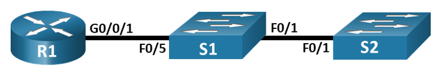
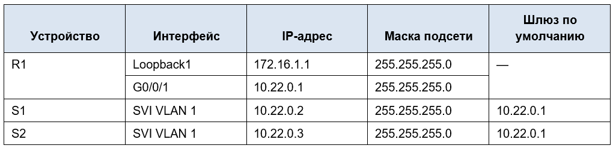

# Лабораторная работа - Настройка протоколов CDP, LLDP и NTP

## Топология



## Таблица адресации



## Часть 2. Обнаружение сетевых ресурсов с помощью протокола CDP

```
R1>enable
R1#conf t
Enter configuration commands, one per line. End with CNTL/Z.
R1(config)#interface loopback 1
%LINK-5-CHANGED: Interface Loopback1, changed state to up
%LINEPROTO-5-UPDOWN: Line protocol on Interface Loopback1, changed state to up
R1(config-if)#ip address 172.16.1.1 255.255.255.0
R1(config-if)#exit
R1(config)#interface g0/0/1
R1(config-if)#ip address 10.22.0.1 255.255.255.0
R1(config-if)#no shut
R1(config-if)#exit
R1(config)#end
R1#
%SYS-5-CONFIG_I: Configured from console by console
R1#show cdp interface
Vlan1 is administratively down, line protocol is down
Sending CDP packets every 60 seconds
Holdtime is 180 seconds
GigabitEthernet0/0/0 is administratively down, line protocol is down
Sending CDP packets every 60 seconds
Holdtime is 180 seconds
GigabitEthernet0/0/1 is up, line protocol is up
Sending CDP packets every 60 seconds
Holdtime is 180 seconds
R1#
R1#show cdp entry S1

Device ID: S1
Entry address(es):
Platform: cisco 2960, Capabilities: Switch
Interface: GigabitEthernet0/0/1, Port ID (outgoing port): FastEthernet0/5
Holdtime: 162
Version :
Cisco IOS Software, C2960 Software (C2960-LANBASEK9-M), Version 15.0(2)SE4, RELEASE SOFTWARE (fc1)
Technical Support: http://www.cisco.com/techsupport
Copyright (c) 1986-2013 by Cisco Systems, Inc.
Compiled Wed 26-Jun-13 02:49 by mnguyen

advertisement version: 2
Duplex: full
```

**Сколько интерфейсов участвует в объявлениях CDP? Какие из них активны?**

В объявлениях CDP участвуют 3 интерфейса: VLAN1, GigabitEthernet0/0/0 и GigabitEthernet0/0/1.
Активен только GigabitEthernet0/0/1.

**Какая версия IOS используется на  S1?**

Cisco IOS Software, C2960 Software (C2960-LANBASEK9-M), Version 15.0(2)SE4, RELEASE SOFTWARE (fc1)

```
S1#show cdp ?
  entry     Information for specific neighbor entry
  interface CDP interface status and configuration
  neighbors CDP neighbor entries
  <cr>
```

Команды show cdp traffic в CPT на коммутаторах нет

```
S1>enable
S1#conf t
Enter configuration commands, one per line. End with CNTL/Z.
S1(config)#interface vlan 1
S1(config-if)#ip address 10.22.0.2 255.255.255.0
S1(config-if)#no shutdown
S1(config-if)#
%LINK-5-CHANGED: Interface Vlan1, changed state to up
%LINEPROTO-5-UPDOWN: Line protocol on Interface Vlan1, changed state to up
S1(config-if)#exit
S1(config)#ip default-gateway 10.22.0.1
S1(config)#end
S1#
%SYS-5-CONFIG_I: Configured from console by console
```

```
S2>ENABLE
S2#conf t
Enter configuration commands, one per line. End with CNTL/Z.
S2(config)#interface vlan 1
S2(config-if)#ip address 10.22.0.3 255.255.255.0
S2(config-if)#no shut
S2(config-if)#
%LINK-5-CHANGED: Interface Vlan1, changed state to up
%LINEPROTO-5-UPDOWN: Line protocol on Interface Vlan1, changed state to up
S2(config-if)#exit
S2(config)#ip default-gateway 10.22.0.1
S2(config)#end
S2#
%SYS-5-CONFIG_I: Configured from console by console
```

**Какие дополнительные сведения доступны теперь?**

После настройки коммутаторов дополнительные сведения - IP адрес на S1

```
R1>enable
R1#conf t
Enter configuration commands, one per line. End with CNTL/Z.
R1(config)#no cdp run
R1(config)#end
R1#
```

```
S1>enable
S1#conf t
Enter configuration commands, one per line. End with CNTL/Z.
S1(config)#no cdp run
S1(config)#end
S1#
%SYS-5-CONFIG_I: Configured from console by console
```

```
S2>enable
S2#conf t
Enter configuration commands, one per line. End with CNTL/Z.
S2(config)#no cdp run
S2(config)#end
S2#
%SYS-5-CONFIG_I: Configured from console by console
```

## Часть 3. Обнаружение сетевых ресурсов с помощью протокола LLDP

Что бы включить LLDP на всех устройствах в топологии, необходимо ввести команду lldp run в режиме глобальной конфигурации.

```
S1#show lldp neighbors detail
---------------------------------------------
Chassis id: 0060.4775.5302
Port id: Gig0/0/1
Port Description: GigabitEthernet0/0/1
System Name: R1
System Description:
Cisco IOS XE Software, Version 03.13.04.S - Extended Support Release
Cisco IOS Software, ISR Software (X86_64_LINUX_IOSD-UNIVERSALK9-M), Version 15.5(3)S5, RELEASE SOFTWARE (fc2)
Technical Support: http://www.cisco.com/techsupport
Copyright (c) 1986-2017 by Cisco Systems, Inc.
Compiled Mon 05-Oct-15 11:24 by mcpre
Time remaining: 90 seconds
System Capabilities: R
Enabled Capabilities: R
Management Addresses - not advertised
Auto Negotiation - supported, enabled
Physical media capabilities:
    1000baseT(FD)
    100baseT(FD)
    1000baseT(HD)
Media Attachment Unit type: 10
Vlan ID: 1

Chassis id: 0090.2189.2101
Port id: Fa0/1
Port Description: FastEthernet0/1
System Name: S2
System Description:
Cisco IOS Software, C2960 Software (C2960-LANBASEK9-M), Version 15.0(2)SE4, RELEASE SOFTWARE (fc1)
Technical Support: http://www.cisco.com/techsupport
Copyright (c) 1986-2013 by Cisco Systems, Inc.
Compiled Wed 26-Jun-13 02:49 by mnguyen
Time remaining: 90 seconds
System Capabilities: B
Enabled Capabilities: B
Management Addresses - not advertised
Auto Negotiation - supported, enabled
Physical media capabilities:
    100baseT(FD)
    100baseT(HD)
    1000baseT(HD)
Media Attachment Unit type: 10
Vlan ID: 1

Total entries displayed: 2
```

В CPT нет команды show lldp entry на коммутаторах, алтернатива - команда show lldp neighbors detail.

**Что такое chassis ID  для коммутатора S2?**

Это идентификатор  устройства в LLDP, в роли Chassis ID часто используется MAC адрес устройства.

```
R1#show lldp neighbors detail
---------------------------------------------
Chassis id: 00D0.5812.9A05
Port id: Fa0/5
Port Description: FastEthernet0/5
System Name: S1
System Description:
Cisco IOS Software, C2960 Software (C2960-LANBASEK9-M), Version 15.0(2)SE4, RELEASE SOFTWARE (fc1)
Technical Support: http://www.cisco.com/techsupport
Copyright (c) 1986-2013 by Cisco Systems, Inc.
Compiled Wed 26-Jun-13 02:49 by mnguyen
Time remaining: 90 seconds
System Capabilities: B
Enabled Capabilities: B
Management Addresses - not advertised
Auto Negotiation - supported, enabled
Physical media capabilities:
    100baseT(FD)
    100baseT(HD)
    1000baseT(HD)
Media Attachment Unit type: 10
Vlan ID: 1

Total entries displayed: 1
```

```
S2#show lldp neighbors detail
---------------------------------------------
Chassis id: 00D0.5812.9A01
Port id: Fa0/1
Port Description: FastEthernet0/1
System Name: S1
System Description:
Cisco IOS Software, C2960 Software (C2960-LANBASEK9-M), Version 15.0(2)SE4, RELEASE SOFTWARE (fc1)
Technical Support: http://www.cisco.com/techsupport
Copyright (c) 1986-2013 by Cisco Systems, Inc.
Compiled Wed 26-Jun-13 02:49 by mnguyen
Time remaining: 90 seconds
System Capabilities: B
Enabled Capabilities: B
Management Addresses - not advertised
Auto Negotiation - supported, enabled
Physical media capabilities:
    100baseT(FD)
    100baseT(HD)
    1000baseT(HD)
Media Attachment Unit type: 10
Vlan ID: 1

Total entries displayed: 1
```

## Часть 4. Настройка NTP

### Шаг 1. Выведите на экран текущее время.

```
R1#show clock detail
*1:14:26.458 UTC Mon Mar 1 1993
Time source is hardware calendar
```

### Шаг 2. Установите время.

```
R1#clock set 18:45:00 27 August 2026
R1#show clock detail
18:45:10.81 UTC Thu Aug 27 2026
Time source is user configuration
```

### Шаг 3. Настройте главный сервер NTP.

```
R1>enable
R1#conf t
Enter configuration commands, one per line. End with CNTL/Z.
R1(config)#ntp master 4
R1(config)#end
R1#
```

### Шаг 4. Настройте клиент NTP.

```
S1#conf t
Enter configuration commands, one per line. End with CNTL/Z.
S1(config)#ntp server 10.22.0.1
S1(config)#end
S1#
%SYS-5-CONFIG_I: Configured from console by console
```

```
S2#conf t
Enter configuration commands, one per line. End with CNTL/Z.
S2(config)#ntp server 10.22.0.1
S2(config)#end
S2#
%SYS-5-CONFIG_I: Configured from console by console
```

### Шаг 5. Проверьте настройку NTP.

```
S1#show ntp associations

address         ref clock       st  when  poll  reach  delay  offset
*~10.22.0.1     127.127.1.1     4   0     32    377    0.00   0.00
                                0.24

* sys.peer, # selected, + candidate, - outlyer, x falseticker, ~ configured

S1#show ntp status
Clock is synchronized, stratum 5, reference is 10.22.0.1
nominal freq is 250.0000 Hz, actual freq is 249.9990 Hz, precision is 2**24
reference time is EE0F8C0E.000002DC (19:25:2.732 UTC Thu Aug 27 2026)
clock offset is 0.00 msec, root delay is 0.00 msec
root dispersion is 10.87 msec, peer dispersion is 0.24 msec.
loopfilter state is 'CTRL' (Normal Controlled Loop), drift is -0.000001193 s/s
poll interval is 5, last update was 13 sec ago.
```

```
S2#show ntp associations

address         ref clock       st  when  poll  reach  delay  offset
*~10.22.0.1     127.127.1.1     4   9     16    377    0.00   0.00
                                0.12

* sys.peer, # selected, + candidate, - outlyer, x falseticker, ~ configured

S2#show ntp status
Clock is synchronized, stratum 16, reference is 10.22.0.1
nominal freq is 250.0000 Hz, actual freq is 249.9990 Hz, precision is 2**24
reference time is 2D057204.00000195 (12:48:4.405 UTC Mon Feb 23 2060)
clock offset is 0.00 msec, root delay is 0.00 msec
root dispersion is 10.06 msec, peer dispersion is 0.12 msec.
loopfilter state is 'CTRL' (Normal Controlled Loop), drift is -0.000001193 s/s
poll interval is 4, last update was 6 sec ago.
```

После настройки NTP время на S1 и S2 синхронизировалось со временем на R1. Оба коммутатора используют R1 (10.22.0.1) в качестве источника NTP.

```
S1#show clock detail
19:28:2.41 UTC Thu Aug 27 2026
Time source is NTP
```

```
S2#show clock detail
19:28:9.523 UTC Thu Aug 27 2026
Time source is NTP
```

## Вопрос для повторения

**Для каких интерфейсов в пределах сети не следует использовать протоколы обнаружения сетевых ресурсов? Поясните ответ.**

CDP и LLDP не следует использовать на интерфейсах, подключённых к внешним или недоверенным сетям. Эти протоколы раскрывают информацию об устройстве и сети, которая может быть использована злоумышленниками.
