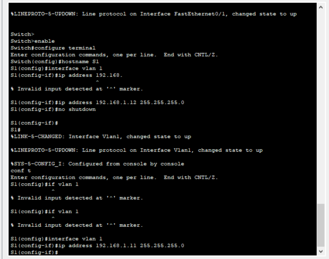
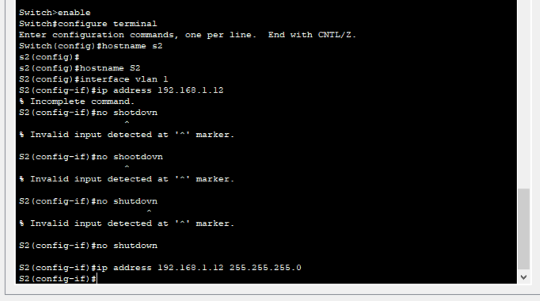
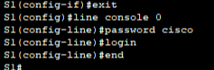
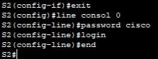

# Лабораторная работа. Базовая настройка коммутатора 

## Топология 


## Таблица адресации 


 ##  Задачи:

 ### Часть 1. Создание и настройка сети
  
 ### Часть 2. Изучение таблицы МАС-адресов коммутатора

b.	Настройте IP-адреса, как указано в таблице адресации.






c.	Назначьте cisco в качестве паролей консоли и VTY.





d.	Назначьте class в качестве пароля доступа к привилегированному режиму EXEC.

```
S1#conf t
Enter configuration commands, one per line.  End with CNTL/Z.
S1(config)#service password-encryption
S1(config)#enable secret class
```


