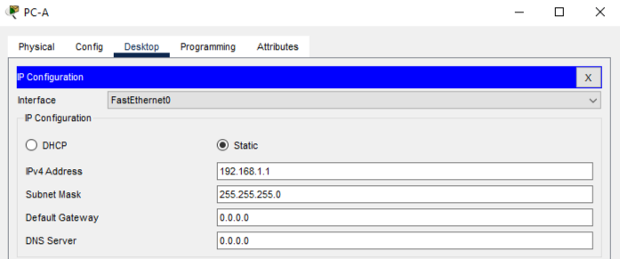
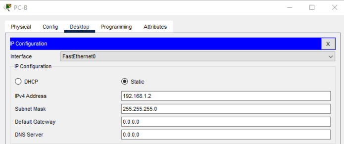

# Лабораторная работа. Базовая настройка коммутатора 

## Топология 

## Таблица адресации 

 ##  Задачи:

 ### Часть 1. Создание и настройка сети
  
 ### Часть 2. Изучение таблицы МАС-адресов коммутатора

b.	Настройте IP-адреса, как указано в таблице адресации.

