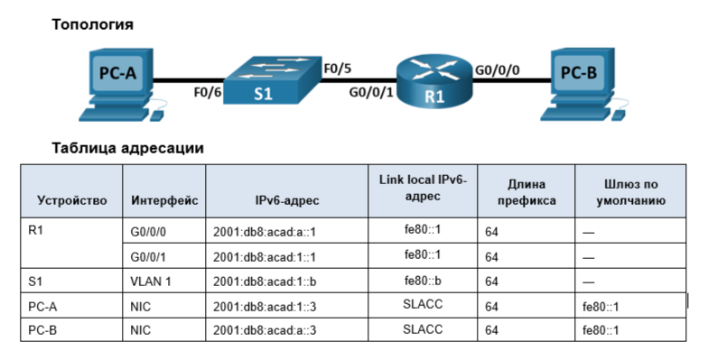

# Лабораторная работа. Настройка IPv6-адресов на сетевых устройствах 



## Часть 2. Ручная настройка IPv6-адресов

### Шаг 1. Назначьте IPv6-адреса интерфейсам Ethernet на R1.
**a.	Назначьте глобальные индивидуальные IPv6-адреса, указанные в таблице адресации обоим интерфейсам Ethernet на R1.**

```
