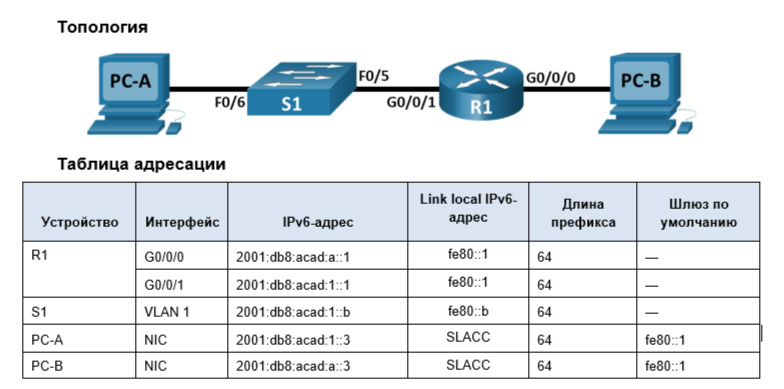

# Лабораторная работа. Настройка IPv6-адресов на сетевых устройствах 



## Часть 2. Ручная настройка IPv6-адресов

### Шаг 1. Назначьте IPv6-адреса интерфейсам Ethernet на R1.
**a.	Назначьте глобальные индивидуальные IPv6-адреса, указанные в таблице адресации обоим интерфейсам Ethernet на R1.**

```
R1(config)#interface gigabitethernet 0/0/0

R1(config-if)#ipv6 address 2001:db8:acad:a::1/64

R1(config-if)#no shutdown

R1(config-if)#exit

R1(config)#interface gigabitethernet 0/0/1

R1(config-if)#ipv6 address 2001:db8:acad:1::1/64

R1(config-if)#no shutdown

R1(config-if)#exit
```

**b.	Введите команду show ipv6 interface brief, чтобы проверить, назначен ли каждому интерфейсу корректный индивидуальный IPv6-адрес.**

```
R1# show ipv6 interface brief
GigabitEthernet0/0/0       [up/up]
    FE80::260:70FF:FE88:6D01
    2001:DB8:ACAD:A::1
GigabitEthernet0/0/1       [up/up]
    FE80::260:70FF:FE88:6D02
    2001:DB8:ACAD:1::1
GigabitEthernet0/0/2       [administratively down/down]
    unassigned
Vlan1                      [administratively down/down]
    unassigned
```

**c.	Чтобы обеспечить соответствие локальных адресов канала индивидуальному адресу, вручную введите локальные адреса канала на каждом интерфейсе Ethernet на R1.**

```
R1#conf t
Enter configuration commands, one per line.  End with CNTL/Z.

R1(config)#interface gigabitethernet 0/0/0

R1(config-if)#ipv6 address  fe80::1 link-local

R1(config-if)#no shutdown

R1(config-if)#exit

R1(config)#interface gigabitethernet 0/0/1

R1(config-if)#ipv6 address  fe80::1 link-local

R1(config-if)#no shutdown

R1(config-if)#exit

R1(config)#exit
```

**d.	Используйте выбранную команду, чтобы убедиться, что локальный адрес связи изменен на fe80::1.**

```
R1#show ipv6 interface brief
GigabitEthernet0/0/0       [up/up]
    FE80::1
    2001:DB8:ACAD:A::1
GigabitEthernet0/0/1       [up/up]
    FE80::1
    2001:DB8:ACAD:1::1
GigabitEthernet0/0/2       [administratively down/down]
    unassigned
Vlan1                      [administratively down/down]
    unassigned
```

### Шаг 2. Активируйте IPv6-маршрутизацию на R1.

**a.	В командной строке на PC-B введите команду ipconfig, чтобы получить данные IPv6-адреса, назначенного интерфейсу ПК.**

```
C:\>ipconfig

FastEthernet0 Connection:(default port)

   Connection-specific DNS Suffix..: 
   Link-local IPv6 Address.........: FE80::2D0:BAFF:FE05:8EBB
   IPv6 Address....................: ::
   IPv4 Address....................: 0.0.0.0
   Subnet Mask.....................: 0.0.0.0
   Default Gateway.................: ::
                                     0.0.0.0
```

**b.	Активируйте IPv6-маршрутизацию на R1 с помощью команды IPv6 unicast-routing.**

```
R1(config)#IPv6 unicast-routing
```

**c.	Теперь, когда R1 входит в группу многоадресной рассылки всех маршрутизаторов, еще раз введите команду ipconfig на PC-B. Проверьте данные IPv6-адреса.**

```

C:\>ipconfig

FastEthernet0 Connection:(default port)

   Connection-specific DNS Suffix..: 
   Link-local IPv6 Address.........: FE80::2D0:BAFF:FE05:8EBB
   IPv6 Address....................: 2001:DB8:ACAD:A:2D0:BAFF:FE05:8EBB
   IPv4 Address....................: 0.0.0.0
   Subnet Mask.....................: 0.0.0.0
   Default Gateway.................: FE80::1
                                     0.0.0.0
```

**Почему PC-B получил глобальный префикс маршрутизации и идентификатор подсети, которые вы настроили на R1?**

PC-B получил глобальный префикс маршрутизации и идентификатор подсети, настроенные на R1, потому что после включения команды:
*ipv6 unicast-routing* маршрутизатор R1 начал работать как IPv6-маршрутизатор и отправлять сообщения Router Advertisement (RA).

### Шаг 3. Назначьте IPv6-адреса интерфейсу управления (SVI) на S1.

**a.	Назначьте адрес IPv6 для S1. Также назначьте этому интерфейсу локальный адрес канала fe80::b.**

```
S1(config)#interface vlan1 
S1(config-if)#ipv6 address 2001:db8:acad:1::b/64
S1(config-if)#no shutdown
S1(config-if)#exit
```

```
S1(config)#interface vlan1 
S1(config-if)#ipv6 address fe80::b link-local
S1(config-if)#no shutdown 
S1(config-if)#exit
```

**b.	Проверьте правильность назначения IPv6-адресов интерфейсу управления с помощью команды show ipv6 interface vlan1.**

```
S1#show ipv6 interface vlan 1
Vlan1 is up, line protocol is up
  IPv6 is enabled, link-local address is FE80::B
  No Virtual link-local address(es):
  Global unicast address(es):
    2001:DB8:ACAD:1::B, subnet is 2001:DB8:ACAD:1::/64
  Joined group address(es):
    FF02::1
    FF02::1:FF00:B
  MTU is 1500 bytes
  ICMP error messages limited to one every 100 milliseconds
  ICMP redirects are enabled
  ICMP unreachables are sent
  Output features: Check hwidb
  ND DAD is enabled, number of DAD attempts: 1
  ND reachable time is 30000 milliseconds
```

### Шаг 4. Назначьте компьютерам статические IPv6-адреса.

**a.	Откройте окно Свойства Ethernet для каждого ПК и назначьте адресацию IPv6. Убедитесь, что оба компьютера имеют правильную информацию адреса IPv6**

PC-A

```
C:\>ipconfig

FastEthernet0 Connection:(default port)

   Connection-specific DNS Suffix..: 
   Link-local IPv6 Address.........: FE80::206:2AFF:FE93:A49B
   IPv6 Address....................: 2001:DB8:ACAD:1::3
   IPv4 Address....................: 0.0.0.0
   Subnet Mask.....................: 0.0.0.0
   Default Gateway.................: FE80::1
                                     0.0.0.0
```

PC-B

```
C:\>ipconfig

FastEthernet0 Connection:(default port)

   Connection-specific DNS Suffix..: 
   Link-local IPv6 Address.........: FE80::2D0:BAFF:FE05:8EBB
   IPv6 Address....................: 2001:DB8:ACAD:A::3
   IPv4 Address....................: 0.0.0.0
   Subnet Mask.....................: 0.0.0.0
   Default Gateway.................: FE80::1
                                     0.0.0.0
```

## Часть 3. Проверка сквозного подключения

**С PC-A отправьте эхо-запрос на FE80::1. Это локальный адрес канала, назначенный G0/1 на R1.**

```
C:\>ping FE80::1

Pinging FE80::1 with 32 bytes of data:

Reply from FE80::1: bytes=32 time<1ms TTL=255
Reply from FE80::1: bytes=32 time<1ms TTL=255
Reply from FE80::1: bytes=32 time<1ms TTL=255
Reply from FE80::1: bytes=32 time<1ms TTL=255

Ping statistics for FE80::1:
    Packets: Sent = 4, Received = 4, Lost = 0 (0% loss),
Approximate round trip times in milli-seconds:
    Minimum = 0ms, Maximum = 0ms, Average = 0ms
```

**Отправьте эхо-запрос на интерфейс управления S1 с PC-A.**

```
C:\>ping 2001:db8:acad:1::b

Pinging 2001:db8:acad:1::b with 32 bytes of data:

Reply from 2001:DB8:ACAD:1::B: bytes=32 time<1ms TTL=255
Reply from 2001:DB8:ACAD:1::B: bytes=32 time<1ms TTL=255
Reply from 2001:DB8:ACAD:1::B: bytes=32 time<1ms TTL=255
Reply from 2001:DB8:ACAD:1::B: bytes=32 time<1ms TTL=255

Ping statistics for 2001:DB8:ACAD:1::B:
    Packets: Sent = 4, Received = 4, Lost = 0 (0% loss),
Approximate round trip times in milli-seconds:
    Minimum = 0ms, Maximum = 0ms, Average = 0ms
```

**Введите команду tracert на PC-A, чтобы проверить наличие сквозного подключения к PC-B.**

```
C:\>tracert 2001:db8:acad:a::3

Tracing route to 2001:db8:acad:a::3 over a maximum of 30 hops: 

  1   0 ms      0 ms      0 ms      2001:DB8:ACAD:1::1
  2   0 ms      0 ms      0 ms      2001:DB8:ACAD:A::3

Trace complete.
```

**С PC-B отправьте эхо-запрос на PC-A.**

```
C:\>ping 2001:db8:acad:1::3

Pinging 2001:db8:acad:1::3 with 32 bytes of data:

Reply from 2001:DB8:ACAD:1::3: bytes=32 time<1ms TTL=127
Reply from 2001:DB8:ACAD:1::3: bytes=32 time<1ms TTL=127
Reply from 2001:DB8:ACAD:1::3: bytes=32 time<1ms TTL=127
Reply from 2001:DB8:ACAD:1::3: bytes=32 time<1ms TTL=127

Ping statistics for 2001:DB8:ACAD:1::3:
    Packets: Sent = 4, Received = 4, Lost = 0 (0% loss),
Approximate round trip times in milli-seconds:
    Minimum = 0ms, Maximum = 0ms, Average = 0ms
```

**С PC-B отправьте эхо-запрос на локальный адрес канала G0/0 на R1.**

```
C:\>ping 2001:db8:acad:a::1

Pinging 2001:db8:acad:a::1 with 32 bytes of data:

Reply from 2001:DB8:ACAD:A::1: bytes=32 time<1ms TTL=255
Reply from 2001:DB8:ACAD:A::1: bytes=32 time<1ms TTL=255
Reply from 2001:DB8:ACAD:A::1: bytes=32 time<1ms TTL=255
Reply from 2001:DB8:ACAD:A::1: bytes=32 time<1ms TTL=255

Ping statistics for 2001:DB8:ACAD:A::1:
    Packets: Sent = 4, Received = 4, Lost = 0 (0% loss),
Approximate round trip times in milli-seconds:
    Minimum = 0ms, Maximum = 0ms, Average = 0ms
```

## Вопросы для повторения

**1.	Почему обоим интерфейсам Ethernet на R1 можно назначить один и тот же локальный адрес канала — FE80::1?**

**2.	Какой идентификатор подсети в индивидуальном IPv6-адресе 2001:db8:acad::aaaa:1234/64?**


Одинаковый link-local адрес FE80::1 можно назначить обоим Ethernet-интерфейсам R1, потому что локальные адреса канала IPv6 действуют только в пределах одного канала/сегмента сети. Они не маршрутизируются за пределы локального сегмента. Поэтому один и тот же link-local адрес может использоваться на разных интерфейсах одного маршрутизатора, если эти интерфейсы находятся в разных сетевых сегментах.

В IPv6-адресе 2001:db8:acad::aaaa:1234/64 префикс /64 означает, что первые 64 бита — это сетевая часть адреса 2001:db8:acad:0000
Здесь идентификатор подсети — это четвертый хекстет: 0000
То есть идентификатор подсети: 0
