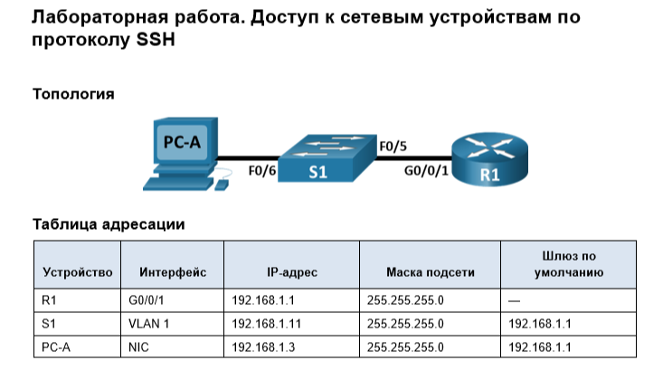

## Часть 1. Настройка основных параметров устройств

### Шаг 3. Настройте маршрутизатор.

```
Router>enable
Router#configure terminal
Enter configuration commands, one per line.  End with CNTL/Z.
Router(config)#hostname R1
R1(config)#no ip domain lookup
R1(config)#enable secret class
R1(config)#line console 0
R1(config-line)#password cisco
R1(config-line)#login
R1(config-line)#end
R1#
%SYS-5-CONFIG_I: Configured from console by console
co
R1#conf t
Enter configuration commands, one per line.  End with CNTL/Z.
R1(config)#line vty 0 4 
R1(config-line)#password cisco
R1(config-line)#login 
R1(config-line)#end
R1#
%SYS-5-CONFIG_I: Configured from console by console

R1#conf t
Enter configuration commands, one per line.  End with CNTL/Z.
R1(config)#service password-encryption 
R1(config)#baner motd #
              ^
% Invalid input detected at '^' marker.
	
R1(config)#banner motd #
Enter TEXT message.  End with the character '#'.
NE TROGAI,YEBET!!!!!! #

R1(config)#interface g0/0/1
R1(config-if)#ip address 192.168.1.1 255.255.255.0
R1(config-if)#no shutdown 

R1(config-if)#
%LINK-5-CHANGED: Interface GigabitEthernet0/0/1, changed state to up

%LINEPROTO-5-UPDOWN: Line protocol on Interface GigabitEthernet0/0/1, changed state to up
```

### Шаг 5. Проверьте подключение к сети.

```
Cisco Packet Tracer PC Command Line 1.0
C:\>ping 192.168.1.1

Pinging 192.168.1.1 with 32 bytes of data:

Reply from 192.168.1.1: bytes=32 time<1ms TTL=255
Reply from 192.168.1.1: bytes=32 time<1ms TTL=255
Reply from 192.168.1.1: bytes=32 time<1ms TTL=255
Reply from 192.168.1.1: bytes=32 time<1ms TTL=255

Ping statistics for 192.168.1.1:
    Packets: Sent = 4, Received = 4, Lost = 0 (0% loss),
Approximate round trip times in milli-seconds:
    Minimum = 0ms, Maximum = 0ms, Average = 0ms
```

## Часть 2. Настройка маршрутизатора для доступа по протоколу SSH

### Шаг 1. Настройте аутентификацию устройств.

```
R1#conf t
Enter configuration commands, one per line.  End with CNTL/Z.
R1(config)#ip domain-lookup rl.net
                            ^
% Invalid input detected at '^' marker.
	
R1(config)#ip domain-name rl.net
```

### Шаг 2. Создайте ключ шифрования с указанием его длины.

```
R1(config)#crypto key generate rsa general-keys modulus 2048
The name for the keys will be: R1.rl.net

% The key modulus size is 2048 bits
% Generating 2048 bit RSA keys, keys will be non-exportable...[OK]
*Mar 1 0:7:43.872: %SSH-5-ENABLED: SSH 1.99 has been enabled
```

### Шаг 3. Создайте имя пользователя в локальной базе учетных записей.

```
R1(config)#isername admin password 12345678
```

### Шаг 4. Активируйте протокол SSH на линиях VTY.

```
R1(config)#line vty 0 4 
R1(config-line)#transport input ssh
R1(config-line)#login local 
R1(config-line)#transport input telnet
R1(config-line)#login local 

```

### Шаг 5. Сохраните текущую конфигурацию в файл загрузочной конфигурации.

```
R1#copy running-config startup-config
Destination filename [startup-config]? 
Building configuration...
[OK]
```
### Шаг 6. Установите соединение с маршрутизатором по протоколу SSH.

```
C:\>ssh -l admin 192.168.1.1

Password: 


NE TROGAI,YEBET!!!!!! 

R1>
```
## Часть 3. Настройка коммутатора для доступа по протоколу SSH

### Шаг 1. Настройте основные параметры коммутатора.

```
S1>enable
S1#conf t
Enter configuration commands, one per line.  End with CNTL/Z.
S1(config)#no ip domain lookup
S1(config)#enable secret class
S1(config)#line console 0
S1(config-line)#password cisco 
S1(config-line)#login
S1(config-line)#end
S1#
%SYS-5-CONFIG_I: Configured from console by console
conf t
Enter configuration commands, one per line.  End with CNTL/Z.
S1(config)#line vty 0 4
S1(config-line)#passwor cisco 
S1(config-line)#login 
S1(config-line)#end
S1#
%SYS-5-CONFIG_I: Configured from console by console

S1#conf t
Enter configuration commands, one per line.  End with CNTL/Z.
S1(config)#service password-encryption
S1(config)#banner motd #
Enter TEXT message.  End with the character '#'.
NE TROGAI,YEBET!!!!!! #

S1(config)#interface vlan 1
S1(config-if)#ip address 192.168.1.2 255.255.255.0
S1(config-if)#ip default-gateway 192.168.1.1
S1(config)#interface vlan 1
S1(config-if)#no shotdown 
                   ^
% Invalid input detected at '^' marker.
	
S1(config-if)#no shutdown 

S1(config-if)#
%LINK-5-CHANGED: Interface Vlan1, changed state to up

%LINEPROTO-5-UPDOWN: Line protocol on Interface Vlan1, changed state to up

S1(config-if)#end
S1#
%SYS-5-CONFIG_I: Configured from console by console

S1#write memory
Building configuration...
[OK]
```

### Шаг 2. Настройте коммутатор для соединения по протоколу SSH.

```
S1#conf t
Enter configuration commands, one per line.  End with CNTL/Z.
S1(config)#ip domain-name s1.net
S1(config)#crypto key generate rsa general-keys modulus 2048
The name for the keys will be: S1.s1.net

% The key modulus size is 2048 bits
% Generating 2048 bit RSA keys, keys will be non-exportable...[OK]
*Mar 1 1:54:27.887: %SSH-5-ENABLED: SSH 1.99 has been enabled
S1(config)#username admin password 12345678
S1(config)#transport input telnet
            ^
% Invalid input detected at '^' marker.
	
S1(config)#line vty 0 4
S1(config-line)#transport input telnet
S1(config-line)#transport input ssh
S1(config-line)#login local 
S1(config-line)#end
S1#
%SYS-5-CONFIG_I: Configured from console by console

S1#write memory
Building configuration...
[OK]
```

### Шаг 3. Установите соединение с коммутатором по протоколу SSH.

```
C:\>ssh -l admin 192.168.1.2

Password: 


NE TROGAI,YEBET!!!!!! 

S1>
```

## Часть 4. Настройка протокола SSH с использованием интерфейса командной строки (CLI) коммутатора

### Шаг 1. Посмотрите доступные параметры для клиента SSH в Cisco IOS.

```
S1>enable 
Password: 
Password: 
S1#ssh ?
  -l  Log in using this user name
  -v  Specify SSH Protocol Version
S1#ssh
```

### Шаг 2. Установите с коммутатора S1 соединение с маршрутизатором R1 по протоколу SSH.

```
S1#ssh -l admin 192.168.1.1

Password: 


NE TROGAI,YEBET!!!!!! 

R1>
```


**Какие версии протокола SSH поддерживаются при использовании интерфейса командной строки?**

1.99 и 2

## 	Вопрос для повторения

Нужно создать несколько локальных пользователей на устройстве, а затем включить вход через локальную базу командой login local
