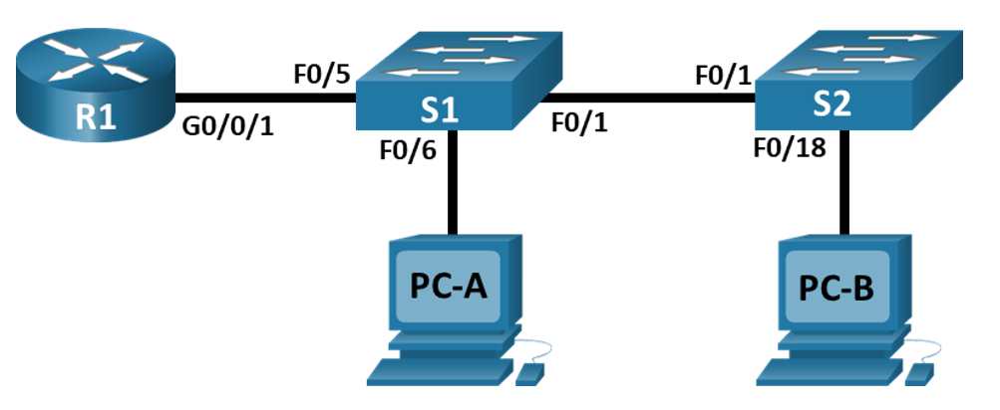
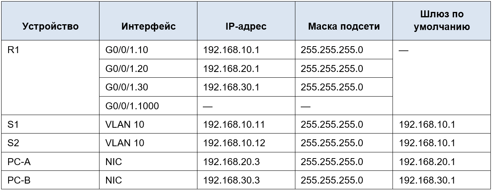
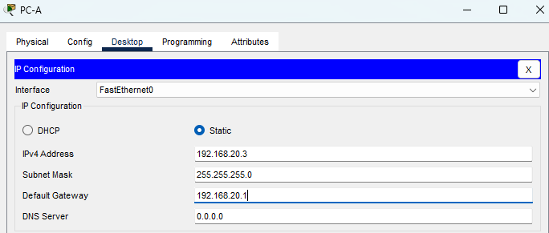
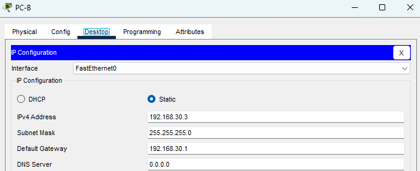

# Внедрение маршрутизации между виртуальными локальными сетями

Работа выполнена на ПК с установленным Cisco Packet Tracer.

#### Топология



#### Таблица адресации



#### Таблица VLAN


### Часть 1. Создание и настройка сети

#### 1.1 Настроить базовые параметры для маршрутизатора

a.	Подключитесь к маршрутизатору с помощью консоли и активируйте привилегированный режим EXEC.
b.	Войдите в режим конфигурации.

```
Router>en
Router#conf t
Enter configuration commands, one per line.  End with CNTL/Z.
Router(config)#
```

c.	Назначьте маршрутизатору имя устройства.

```
Router(config)#hostname R1
R1(config)#
```

d.	Отключите поиск DNS, чтобы предотвратить попытки маршрутизатора неверно преобразовывать введенные команды таким образом, как будто они являются именами узлов.

```
R1(config)# no ip domain-lookup 
R1(config)#
```

e.	Назначьте class в качестве зашифрованного пароля привилегированного режима EXEC.

```
R1(config)#ena
R1(config)#enable se
R1(config)#enable secret class
R1(config)#
```

f.	Назначьте cisco в качестве пароля консоли и включите вход в систему по паролю.

```
R1(config)#line console 0
R1(config-line)#pas
R1(config-line)#password cisco
R1(config-line)#lo
R1(config-line)#log
R1(config-line)#login
R1(config-line)#
```

g.	Установите cisco в качестве пароля виртуального терминала и активируйте вход.

```
R1(config)#line vt
R1(config)#line vty 0 4
R1(config-line)#pass
R1(config-line)#password cisco
R1(config-line)#login
R1(config-line)#
```

h.	Зашифруйте открытые пароли.

```
R1(config)#service password-encryption 
```

i.	Создайте баннер с предупреждением о запрете несанкционированного доступа к устройству.

```
R1(config)#banner motd #write exit#
```

j.	Сохраните текущую конфигурацию в файл загрузочной конфигурации.

```
R1#
%SYS-5-CONFIG_I: Configured from console by console
write memory
Building configuration...
[OK]
```

k.	Настройте на маршрутизаторе время.

```
R1#clock set 13:22:00 9 aug 2026
```

#### 1.2 Настроить базовые параметры для каждого коммутатора

a. Настраиваем имена устройств в соответствии с топологией.

```
Switch>en
Switch>enable 
Switch#conf t
Switch(config)#hostname S1
S1(config)#
```

```
Switch>EN
Switch#conf t
Enter configuration commands, one per line.  End with CNTL/Z.
Switch(config)#ho
Switch(config)#hostname S2
S2(config)#
```

b.	Отключите поиск DNS, чтобы предотвратить попытки маршрутизатора неверно преобразовывать введенные команды таким образом, как будто они являются именами узлов.

```
S1(config)#no ip domain-lookup
S1(config)#
```

```
S2(config)#no ip domain-lookup
S2(config)#
```

c.	Назначьте class в качестве зашифрованного пароля привилегированного режима EXEC.

```
S1(config)#en
S1(config)#enable s
S1(config)#enable secret class
S1(config)#
```

```
S2(config)#en
S2(config)#enable s
S2(config)#enable secret class
```

d.	Назначьте cisco в качестве пароля консоли и включите вход в систему по паролю.

```
S1(config)#line
S1(config)#line cons
S1(config)#line console 0
S1(config-line)#password cisco
S1(config-line)#login
```

```
S2(config)#line
S2(config)#line cons
S2(config)#line console 0
S2(config-line)#pas
S2(config-line)#password cisco
S2(config-line)#login
```

e.	Установите cisco в качестве пароля виртуального терминала и активируйте вход.

```
S1(config)#line vty 0 4
S1(config-line)#login
% Login disabled on line 1, until 'password' is set
% Login disabled on line 2, until 'password' is set
% Login disabled on line 3, until 'password' is set
% Login disabled on line 4, until 'password' is set
% Login disabled on line 5, until 'password' is set
S1(config-line)#pas
S1(config-line)#password cisco
S1(config-line)#login
```

```
S2(config)#line v
S2(config)#line vty 0 4
S2(config-line)#pas
S2(config-line)#password cisco
S2(config-line)#login
```

f.	Зашифруйте открытые пароли.

```
S1(config)#service password-encryption
```

```
S2(config)#service password-encryption
```

g.	Создайте баннер с предупреждением о запрете несанкционированного доступа к устройству.

```
S1(config)#ba
S1(config)#banner m
S1(config)#banner motd #what to write#
```

```
S2(config)#banner m
S2(config)#banner motd #what to write2#
```

h.	Настройте на коммутаторах время.

```
S1#clock set 13:36:00 9 aug 2026
```

```
S2#clock set 13:38:00 9 aug 2026
```

i.	Сохранение текущей конфигурации в качестве начальной.

```
S1#write m
S1#write memory 
Building configuration...
[OK]
S1#
```

```
S2#write m
S2#write memory 
Building configuration...
[OK]
S2#
```

#### 1.3 Настроить базовые параметры для каждого ПК




Проверка

```
Cisco Packet Tracer PC Command Line 1.0
C:\>ipconfig

FastEthernet0 Connection:(default port)

   Connection-specific DNS Suffix..: 
   Link-local IPv6 Address.........: FE80::20C:85FF:FE3C:AE9
   IPv6 Address....................: ::
   IPv4 Address....................: 192.168.20.3
   Subnet Mask.....................: 255.255.255.0
   Default Gateway.................: ::
                                     192.168.20.1
```


### Часть 2. Создание сетей VLAN и назначение портов коммутатора

#### 2.1 Создайте сети VLAN на коммутаторах.

a.	Создайте и назовите необходимые VLAN на каждом коммутаторе из таблицы выше.

```
S1(config)#vlan 10
S1(config-vlan)#na
S1(config-vlan)#name  Management
S1(config-vlan)#exit
S1(config)#vlan 20
S1(config-vlan)#nam
S1(config-vlan)#name Sales
S1(config-vlan)#exit
S1(config)#vlan 30
S1(config-vlan)#na
S1(config-vlan)#name Operations
S1(config-vlan)#exit
S1(config)#vl
S1(config)#vlan 999
S1(config-vlan)#na
S1(config-vlan)#name 
S1(config-vlan)#name 
S1(config-vlan)#name Parking_Lot
S1(config-vlan)#exit
S1(config-if)#vlan 1000
S1(config-vlan)#nam
S1(config-vlan)#name My
```

```
S2(config)#vl
S2(config)#vlan 10
S2(config-vlan)#n
S2(config-vlan)#n
S2(config-vlan)#na
S2(config-vlan)#name M
S2(config-vlan)#name Management
S2(config-vlan)#EXIT
S2(config)#vlan 20
S2(config-vlan)#na
S2(config-vlan)#name Sales
S2(config-vlan)#exit
S2(config)#vlan 30
S2(config-vlan)#name Operations
S2(config-vlan)#exit
S2(config)#vlan999
               ^
% Invalid input detected at '^' marker.

S2(config)#vlan 999
S2(config-vlan)#na
S2(config-vlan)#name Parking_Lot
S2(config-vlan)#exit
S2(config)#vlan 1000
S2(config-vlan)#na
S2(config-vlan)#name My
S2(config-vlan)#exit
S2(config)#
```

b.	Настройте интерфейс управления и шлюз по умолчанию на каждом коммутаторе, используя информацию об IP-адресе в таблице адресации. 

```
S1(config)#interface vlan 10
S1(config-if)#
%LINK-5-CHANGED: Interface Vlan10, changed state to up
ip
S1(config-if)#ip ad
S1(config-if)#
S1(config-if)#ip ad
S1(config-if)#ip address 192.168.10.11 255.255.255.0
S1(config-if)#no sh
S1(config-if)#no shutdown 
S1(config-if)#ip
S1(config-if)#ip de
S1(config-if)#ip def
S1(config-if)#ip defau
S1(config-if)#exit
S1(config)#ip d
S1(config)#ip deaf
S1(config)#ip def
S1(config)#ip default-gateway 192.168.10.1
```

```
S2(config)#int
S2(config)#interface v
S2(config)#interface vlan 10
S2(config-if)#
%LINK-5-CHANGED: Interface Vlan10, changed state to up
ip ad
S2(config-if)#ip address 192.168.10.12 255.255.255.0
S2(config-if)#no sh
S2(config-if)#no shutdown 
S2(config-if)#exit
S2(config)#ip de
S2(config)#ip default-gateway 192.168.10.1
S2(config)#
```

c.	Назначьте все неиспользуемые порты коммутатора VLAN Parking_Lot, настройте их для статического режима доступа и административно деактивируйте их.

```
S1(config)#int
S1(config)#interface ra
S1(config)#interface range f
S1(config)#interface range f0/2-4, f0/7-24, g0/1-2
S1(config-if-range)#sw
S1(config-if-range)#switchport m
S1(config-if-range)#switchport mode ac
S1(config-if-range)#switchport mode access 
S1(config-if-range)#s
S1(config-if-range)#sw
S1(config-if-range)#switchport p
S1(config-if-range)#switchport po
S1(config-if-range)#switchport ac
S1(config-if-range)#switchport access v
S1(config-if-range)#switchport access vlan 999
S1(config-if-range)#shut
S1(config-if-range)#shutdown 

%LINK-5-CHANGED: Interface FastEthernet0/2, changed state to administratively down

%LINK-5-CHANGED: Interface FastEthernet0/3, changed state to administratively down

%LINK-5-CHANGED: Interface FastEthernet0/4, changed state to administratively down

%LINK-5-CHANGED: Interface FastEthernet0/7, changed state to administratively down

%LINK-5-CHANGED: Interface FastEthernet0/8, changed state to administratively down

%LINK-5-CHANGED: Interface FastEthernet0/9, changed state to administratively down

%LINK-5-CHANGED: Interface FastEthernet0/10, changed state to administratively down

%LINK-5-CHANGED: Interface FastEthernet0/11, changed state to administratively down

%LINK-5-CHANGED: Interface FastEthernet0/12, changed state to administratively down

%LINK-5-CHANGED: Interface FastEthernet0/13, changed state to administratively down

%LINK-5-CHANGED: Interface FastEthernet0/14, changed state to administratively down

%LINK-5-CHANGED: Interface FastEthernet0/15, changed state to administratively down

%LINK-5-CHANGED: Interface FastEthernet0/16, changed state to administratively down

%LINK-5-CHANGED: Interface FastEthernet0/17, changed state to administratively down

%LINK-5-CHANGED: Interface FastEthernet0/18, changed state to administratively down

%LINK-5-CHANGED: Interface FastEthernet0/19, changed state to administratively down

%LINK-5-CHANGED: Interface FastEthernet0/20, changed state to administratively down

%LINK-5-CHANGED: Interface FastEthernet0/21, changed state to administratively down

%LINK-5-CHANGED: Interface FastEthernet0/22, changed state to administratively down

%LINK-5-CHANGED: Interface FastEthernet0/23, changed state to administratively down

%LINK-5-CHANGED: Interface FastEthernet0/24, changed state to administratively down

%LINK-5-CHANGED: Interface GigabitEthernet0/1, changed state to administratively down

%LINK-5-CHANGED: Interface GigabitEthernet0/2, changed state to administratively down
S1(config-if-range)#
```

```
S2(config)#int
S2(config)#interface  r
S2(config)#interface range f0/2-17, f0/19-24, g0/1-2 
S2(config-if-range)#sw
S2(config-if-range)#switchport m
S2(config-if-range)#switchport mode ac
S2(config-if-range)#switchport mode access 
S2(config-if-range)#sw
S2(config-if-range)#switchport ac
S2(config-if-range)#switchport access v
S2(config-if-range)#switchport access vlan 999
S2(config-if-range)#shut
S2(config-if-range)#shutdown 

%LINK-5-CHANGED: Interface FastEthernet0/2, changed state to administratively down

%LINK-5-CHANGED: Interface FastEthernet0/3, changed state to administratively down

%LINK-5-CHANGED: Interface FastEthernet0/4, changed state to administratively down

%LINK-5-CHANGED: Interface FastEthernet0/5, changed state to administratively down

%LINK-5-CHANGED: Interface FastEthernet0/6, changed state to administratively down

%LINK-5-CHANGED: Interface FastEthernet0/7, changed state to administratively down

%LINK-5-CHANGED: Interface FastEthernet0/8, changed state to administratively down

%LINK-5-CHANGED: Interface FastEthernet0/9, changed state to administratively down

%LINK-5-CHANGED: Interface FastEthernet0/10, changed state to administratively down

%LINK-5-CHANGED: Interface FastEthernet0/11, changed state to administratively down

%LINK-5-CHANGED: Interface FastEthernet0/12, changed state to administratively down

%LINK-5-CHANGED: Interface FastEthernet0/13, changed state to administratively down

%LINK-5-CHANGED: Interface FastEthernet0/14, changed state to administratively down

%LINK-5-CHANGED: Interface FastEthernet0/15, changed state to administratively down

%LINK-5-CHANGED: Interface FastEthernet0/16, changed state to administratively down

%LINK-5-CHANGED: Interface FastEthernet0/17, changed state to administratively down

%LINK-5-CHANGED: Interface FastEthernet0/19, changed state to administratively down

%LINK-5-CHANGED: Interface FastEthernet0/20, changed state to administratively down

%LINK-5-CHANGED: Interface FastEthernet0/21, changed state to administratively down

%LINK-5-CHANGED: Interface FastEthernet0/22, changed state to administratively down

%LINK-5-CHANGED: Interface FastEthernet0/23, changed state to administratively down

%LINK-5-CHANGED: Interface FastEthernet0/24, changed state to administratively down

%LINK-5-CHANGED: Interface GigabitEthernet0/1, changed state to administratively down

%LINK-5-CHANGED: Interface GigabitEthernet0/2, changed state to administratively down
S2(config-if-range)#
```

Примечание. Команда interface range полезна для выполнения этой задачи с минимальным количеством команд.


#### 2.2 Назначьте сети VLAN соответствующим интерфейсам коммутатора.

a.	Назначьте используемые порты соответствующей VLAN (указанной в таблице VLAN выше) и настройте их для режима статического доступа.

```
S1(config-if-range)#
S1(config-if-range)#exit
S1(config)#int
S1(config)#interface f0/6
S1(config-if)#sw
S1(config-if)#switchport m
S1(config-if)#switchport mode a
S1(config-if)#switchport mode access 
S1(config-if)#sw
S1(config-if)#switchport ac
S1(config-if)#switchport access v
S1(config-if)#switchport access vlan 20
S1(config-if)#no s
S1(config-if)#no sh
S1(config-if)#no shutdown 
S1(config-if)#
```

```
S2(config-if-range)#exit
S2(config)#int
S2(config)#interface f0/18
S2(config-if)#sw
S2(config-if)#switchport m
S2(config-if)#switchport mode ac
S2(config-if)#switchport mode access 
S2(config-if)#sw
S2(config-if)#switchport a
S2(config-if)#switchport access v
S2(config-if)#switchport access vlan 30
S2(config-if)#no sh
S2(config-if)#no shutdown 
```

b.	Убедитесь, что VLAN назначены на правильные интерфейсы.

```
S1#show vlan brief 

VLAN Name                             Status    Ports
---- -------------------------------- --------- -------------------------------
1    default                          active    Fa0/1, Fa0/5
10   Management                       active    
20   Sales                            active    Fa0/6
30   Operations                       active    
999  Parking_Lot                      active    Fa0/2, Fa0/3, Fa0/4, Fa0/7
                                                Fa0/8, Fa0/9, Fa0/10, Fa0/11
                                                Fa0/12, Fa0/13, Fa0/14, Fa0/15
                                                Fa0/16, Fa0/17, Fa0/18, Fa0/19
                                                Fa0/20, Fa0/21, Fa0/22, Fa0/23
                                                Fa0/24, Gig0/1, Gig0/2
1000 My                               active    
1002 fddi-default                     active    
1003 token-ring-default               active    
1004 fddinet-default                  active    
1005 trnet-default                    active    
```

```
S2#show vlan brief 

VLAN Name                             Status    Ports
---- -------------------------------- --------- -------------------------------
1    default                          active    Fa0/1
10   Management                       active    
20   Sales                            active    
30   Operations                       active    Fa0/18
999  Parking_Lot                      active    Fa0/2, Fa0/3, Fa0/4, Fa0/5
                                                Fa0/6, Fa0/7, Fa0/8, Fa0/9
                                                Fa0/10, Fa0/11, Fa0/12, Fa0/13
                                                Fa0/14, Fa0/15, Fa0/16, Fa0/17
                                                Fa0/19, Fa0/20, Fa0/21, Fa0/22
                                                Fa0/23, Fa0/24, Gig0/1, Gig0/2
1000 My                               active    
1002 fddi-default                     active    
1003 token-ring-default               active    
1004 fddinet-default                  active    
1005 trnet-default                    active 
```

### Часть 3. Конфигурация магистрального канала стандарта 802.1Q между коммутаторами

#### 3.1 Вручную настройте магистральный интерфейс F0/1 на коммутаторах S1 и S2.

a.	Настройка статического транкинга на интерфейсе F0/1 для обоих коммутаторов.

```
S1(config)#int
S1(config)#interface f0/1
S1(config-if)#sw
S1(config-if)#switchport m
S1(config-if)#switchport mode tr
S1(config-if)#switchport mode trunk 

S1(config-if)#
%LINEPROTO-5-UPDOWN: Line protocol on Interface FastEthernet0/1, changed state to down

%LINEPROTO-5-UPDOWN: Line protocol on Interface FastEthernet0/1, changed state to up

%LINEPROTO-5-UPDOWN: Line protocol on Interface Vlan10, changed state to up
```


```
S2(config)#int
S2(config)#interface f0/1
S2(config-if)#sw
S2(config-if)#switchport m
S2(config-if)#switchport mode tr
S2(config-if)#switchport mode trunk 
S2(config-if)#exit
S2(config)#
```


b.	Установите native VLAN 1000 на обоих коммутаторах.

```
S1(config)#interface f0/1
S1(config-if)#sw
S1(config-if)#switchport tr
S1(config-if)#switchport trunk n
S1(config-if)#switchport trunk native vl
S1(config-if)#switchport trunk native vlan 1000
S1(config-if)#%SPANTREE-2-UNBLOCK_CONSIST_PORT: Unblocking FastEthernet0/1 on VLAN1000. Port consistency restored.

%SPANTREE-2-UNBLOCK_CONSIST_PORT: Unblocking FastEthernet0/1 on VLAN0001. Port consistency restored.

S1(config-if)#exit
```

```
S2(config)#
S2(config)#int
S2(config)#interface f0/1
S2(config-if)#sw
S2(config-if)#switchport tr
S2(config-if)#switchport trunk vl
S2(config-if)#switchport trunk vla
S2(config-if)#switchport trunk n
S2(config-if)#switchport trunk native v
S2(config-if)#switchport trunk native vlan 1000
S2(config-if)#exit

%CDP-4-NATIVE_VLAN_MISMATCH: Native VLAN mismatch discovered on FastEthernet0/1 (1000), with S1 FastEthernet0/1 (1).
```


c.	Укажите, что VLAN 10, 20, 30 и 1000 могут проходить по транку.

```
S1(config)#interface f0/1
S1(config-if)#sw
S1(config-if)#switchport tr
S1(config-if)#switchport trunk al
S1(config-if)#switchport trunk allowed vl
S1(config-if)#switchport trunk allowed vlan 10?
WORD  
S1(config-if)#switchport trunk allowed vlan 10,20,30,1000
S1(config-if)#
```

```
S2(config)#
S2(config)#int
S2(config)#interface f0/1
S2(config-if)#sw
S2(config-if)#switchport tr
S2(config-if)#switchport trunk al
S2(config-if)#switchport trunk allowed vla
S2(config-if)#switchport trunk allowed vlan 10,20,30,1000
S2(config-if)#
```

d.	Проверьте транки, native VLAN и разрешенные VLAN через транк.

```

S1#show interfaces trunk 
Port        Mode         Encapsulation  Status        Native vlan
Fa0/1       on           802.1q         trunking      1000

Port        Vlans allowed on trunk
Fa0/1       10,20,30,1000

Port        Vlans allowed and active in management domain
Fa0/1       10,20,30,1000

Port        Vlans in spanning tree forwarding state and not pruned
Fa0/1       10,20,30,1000

S1#show interfaces f0/1 switchport
Name: Fa0/1
Switchport: Enabled
Administrative Mode: trunk
Operational Mode: trunk
Administrative Trunking Encapsulation: dot1q
Operational Trunking Encapsulation: dot1q
Negotiation of Trunking: On
Access Mode VLAN: 1 (default)
Trunking Native Mode VLAN: 1000 (My)
Voice VLAN: none
Administrative private-vlan host-association: none
Administrative private-vlan mapping: none
Administrative private-vlan trunk native VLAN: none
Administrative private-vlan trunk encapsulation: dot1q
Administrative private-vlan trunk normal VLANs: none
Administrative private-vlan trunk private VLANs: none
Operational private-vlan: none
Trunking VLANs Enabled: 10,20,30,1000
Pruning VLANs Enabled: 2-1001
Capture Mode Disabled
Capture VLANs Allowed: ALL
Protected: false
Unknown unicast blocked: disabled
Unknown multicast blocked: disabled
Appliance trust: none
```

```
S2#show interfaces trunk 
Port        Mode         Encapsulation  Status        Native vlan
Fa0/1       on           802.1q         trunking      1000

Port        Vlans allowed on trunk
Fa0/1       10,20,30,1000

Port        Vlans allowed and active in management domain
Fa0/1       10,20,30,1000

Port        Vlans in spanning tree forwarding state and not pruned
Fa0/1       10,20,30,1000


S2#show interfaces f0/1 sw
S2#show interfaces f0/1 switchport 
Name: Fa0/1
Switchport: Enabled
Administrative Mode: trunk
Operational Mode: trunk
Administrative Trunking Encapsulation: dot1q
Operational Trunking Encapsulation: dot1q
Negotiation of Trunking: On
Access Mode VLAN: 1 (default)
Trunking Native Mode VLAN: 1000 (My)
Voice VLAN: none
Administrative private-vlan host-association: none
Administrative private-vlan mapping: none
Administrative private-vlan trunk native VLAN: none
Administrative private-vlan trunk encapsulation: dot1q
Administrative private-vlan trunk normal VLANs: none
Administrative private-vlan trunk private VLANs: none
Operational private-vlan: none
Trunking VLANs Enabled: 10,20,30,1000
Pruning VLANs Enabled: 2-1001
Capture Mode Disabled
Capture VLANs Allowed: ALL
Protected: false
Unknown unicast blocked: disabled
Unknown multicast blocked: disabled
Appliance trust: none
```


#### 3.2 Вручную настройте магистральный интерфейс F0/5 на коммутаторе S1.

a.	Настройте интерфейс S1 F0/5 с теми же параметрами транка, что и F0/1. Это транк до маршрутизатора.

```
S1(config)#interface f0/5
S1(config-if)#sw
S1(config-if)#switchport m
S1(config-if)#switchport mode a
S1(config-if)#switchport mode access 
S1(config-if)#sw
S1(config-if)#switchport m
S1(config-if)#switchport mode t
S1(config-if)#switchport mode trunk 
S1(config-if)#sw
S1(config-if)#switchport tr
S1(config-if)#switchport trunk v
S1(config-if)#switchport trunk vl
S1(config-if)#switchport trunk vl
S1(config-if)#switchport trunk vla
S1(config-if)#switchport trunk n
S1(config-if)#switchport trunk native v
S1(config-if)#switchport trunk native vlan 1000
S1(config-if)#sw
S1(config-if)#switchport tr
S1(config-if)#switchport trunk n
S1(config-if)#switchport trunk al
S1(config-if)#switchport trunk allowed v
S1(config-if)#switchport trunk allowed vlan 10,20,30,1000
```

```
S2(config)#int
S2(config)#interface  f0/5
S2(config-if)#sw
S2(config-if)#switchport  m
S2(config-if)#switchport  mode t
S2(config-if)#switchport  mode trunk 
S2(config-if)#sw
S2(config-if)#switchport tr
S2(config-if)#switchport trunk n
S2(config-if)#switchport trunk native v
S2(config-if)#switchport trunk native vlan 1000
S2(config-if)#sw
S2(config-if)#switchport tr
S2(config-if)#switchport trunk al
S2(config-if)#switchport trunk allowed vl
S2(config-if)#switchport trunk allowed vlan 10,20,30,1000
S2(config-if)#
```

b.	Сохраните текущую конфигурацию в файл загрузочной конфигурации.

```
wr m
S1#wr memory 
Building configuration...
```

```
S2#write m
S2#write memory 
Building configuration...
[OK]
S2#
```

c.	Проверка транкинга.

```
S1#show interfaces trunk 
Port        Mode         Encapsulation  Status        Native vlan
Fa0/1       on           802.1q         trunking      1000

Port        Vlans allowed on trunk
Fa0/1       10,20,30,1000

Port        Vlans allowed and active in management domain
Fa0/1       10,20,30,1000

Port        Vlans in spanning tree forwarding state and not pruned
Fa0/1       10,20,30,1000

S1#show int
S1#show interfaces f0/5 sw
S1#show interfaces f0/5 switchport 
Name: Fa0/5
Switchport: Enabled
Administrative Mode: trunk
Operational Mode: down
Administrative Trunking Encapsulation: dot1q
Operational Trunking Encapsulation: dot1q
Negotiation of Trunking: Off
Access Mode VLAN: 1 (default)
Trunking Native Mode VLAN: 1000 (My)
Voice VLAN: none
Administrative private-vlan host-association: none
Administrative private-vlan mapping: none
Administrative private-vlan trunk native VLAN: none
Administrative private-vlan trunk encapsulation: dot1q
Administrative private-vlan trunk normal VLANs: none
Administrative private-vlan trunk private VLANs: none
Operational private-vlan: none
Trunking VLANs Enabled: 10,20,30,1000
Pruning VLANs Enabled: 2-1001
Capture Mode Disabled
Capture VLANs Allowed: ALL
Protected: false
Unknown unicast blocked: disabled
Unknown multicast blocked: disabled
Appliance trust: none
```

```
S2#show interfaces tr
S2#show interfaces trunk 
Port        Mode         Encapsulation  Status        Native vlan
Fa0/1       on           802.1q         trunking      1000

Port        Vlans allowed on trunk
Fa0/1       10,20,30,1000

Port        Vlans allowed and active in management domain
Fa0/1       10,20,30,1000

Port        Vlans in spanning tree forwarding state and not pruned
Fa0/1       10,20,30,1000

S2#sh
S2#show int
S2#show interfaces f0/5 s
S2#show interfaces f0/5 sw
S2#show interfaces f0/5 switchport 
Name: Fa0/5
Switchport: Enabled
Administrative Mode: trunk
Operational Mode: down
Administrative Trunking Encapsulation: dot1q
Operational Trunking Encapsulation: dot1q
Negotiation of Trunking: Off
Access Mode VLAN: 999 (Parking_Lot)
Trunking Native Mode VLAN: 1000 (My)
Voice VLAN: none
Administrative private-vlan host-association: none
Administrative private-vlan mapping: none
Administrative private-vlan trunk native VLAN: none
Administrative private-vlan trunk encapsulation: dot1q
Administrative private-vlan trunk normal VLANs: none
Administrative private-vlan trunk private VLANs: none
Operational private-vlan: none
Trunking VLANs Enabled: 10,20,30,1000
Pruning VLANs Enabled: 2-1001
Capture Mode Disabled
Capture VLANs Allowed: ALL
Protected: false
Unknown unicast blocked: disabled
Unknown multicast blocked: disabled
Appliance trust: none
```

Вопрос: Что произойдет, если G0/0/1 на R1 будет отключен?
Ответ: маршрутизатор выволняет общение между коммутаторами, без него компьютеры не смогут общаться, если не находятся в одном влане. Также шлюз будет не доступен и подключение к коммутатору для настройки кроме как напрямую будет невозможно.

```
C:\>ping 192.168.30.3

Pinging 192.168.30.3 with 32 bytes of data:

Request timed out.
Request timed out.
```


### Часть 4. Настройка маршрутизации между сетями VLAN

#### 4.1 Настройте маршрутизатор

a.	При необходимости активируйте интерфейс G0/0/1 на маршрутизаторе.

```
interface g0/1
R1(config-if)#no shutdown 

R1(config-if)#
%LINK-5-CHANGED: Interface GigabitEthernet0/1, changed state to up
```


b.	Настройте подинтерфейсы для каждой VLAN, как указано в таблице IP-адресации. Все подинтерфейсы используют инкапсуляцию 802.1Q. Убедитесь, что подинтерфейсу для native VLAN не назначен IP-адрес. Включите описание для каждого подинтерфейса.


```
R1(config)#int
R1(config)#interface g0/0/1.10
%Invalid interface type and number
R1(config)#interface g0/1.10
R1(config-subif)#
%LINK-5-CHANGED: Interface GigabitEthernet0/1.10, changed state to up

%LINEPROTO-5-UPDOWN: Line protocol on Interface GigabitEthernet0/1.10, changed state to up
en
R1(config-subif)#encapsulation d
R1(config-subif)#encapsulation dot1Q 10
R1(config-subif)#ip ad
R1(config-subif)#ip address 192.168.10.1 255.255.255.0
R1(config-subif)#d
R1(config-subif)#des
R1(config-subif)#description Management_VLAN_10

R1#conf t
Enter configuration commands, one per line.  End with CNTL/Z.
R1(config)#interface g0/1.20
R1(config-subif)#
%LINK-5-CHANGED: Interface GigabitEthernet0/1.20, changed state to up

%LINEPROTO-5-UPDOWN: Line protocol on Interface GigabitEthernet0/1.20, changed state to up
encapsulation dot1Q 20
R1(config-subif)#ip address 192.168.20.1 255.255.255.0
R1(config-subif)#description Sales_VLAN_20
R1(config-subif)#exit
R1(config)#interface g0/1.30
R1(config-subif)#
%LINK-5-CHANGED: Interface GigabitEthernet0/1.30, changed state to up

%LINEPROTO-5-UPDOWN: Line protocol on Interface GigabitEthernet0/1.30, changed state to up
encapsulation dot1Q 30
R1(config-subif)#ip address 192.168.30.1 255.255.255.0
R1(config-subif)#description Operations_VLAN_30
R1(config-subif)#exit
R1(config)#interface g0/1.1000
R1(config-subif)#
%LINK-5-CHANGED: Interface GigabitEthernet0/1.1000, changed state to up

%LINEPROTO-5-UPDOWN: Line protocol on Interface GigabitEthernet0/1.1000, changed state to up
encapsulation dot1Q 1000
R1(config-subif)#description My_NativeVLAN_1000
R1(config-subif)#no ip ad
R1(config-subif)#no ip address 
R1(config-subif)#exit
R1(config)#
```

c.	Убедитесь, что вспомогательные интерфейсы работают

```
R1#show ip interface brief 
Interface              IP-Address      OK? Method Status                Protocol 
GigabitEthernet0/0     unassigned      YES unset  administratively down down 
GigabitEthernet0/1     unassigned      YES unset  up                    up 
GigabitEthernet0/1.10  192.168.10.1    YES manual up                    up 
GigabitEthernet0/1.20  192.168.20.1    YES manual up                    up 
GigabitEthernet0/1.30  192.168.30.1    YES manual up                    up 
GigabitEthernet0/1.1000unassigned      YES unset  up                    up 
Vlan1                  unassigned      YES unset  administratively down down
R1#
```


### Часть 5. Проверьте, работает ли маршрутизация между VLAN

#### 5.1 Выполните следующие тесты с PC-A. Все должно быть успешно.

Примечание. Возможно, вам придется отключить брандмауэр ПК для работы ping

a.	Отправьте эхо-запрос с PC-A на шлюз по умолчанию.

```
C:\>ping 192.168.10.1

Pinging 192.168.10.1 with 32 bytes of data:

Reply from 192.168.10.1: bytes=32 time=1ms TTL=255
Reply from 192.168.10.1: bytes=32 time<1ms TTL=255
Reply from 192.168.10.1: bytes=32 time=2ms TTL=255
Reply from 192.168.10.1: bytes=32 time<1ms TTL=255

Ping statistics for 192.168.10.1:
    Packets: Sent = 4, Received = 4, Lost = 0 (0% loss),
Approximate round trip times in milli-seconds:
    Minimum = 0ms, Maximum = 2ms, Average = 0ms
```


b.	Отправьте эхо-запрос с PC-A на PC-B.

```
Pinging 192.168.30.3 with 32 bytes of data:

Request timed out.
Reply from 192.168.30.3: bytes=32 time<1ms TTL=127
Reply from 192.168.30.3: bytes=32 time<1ms TTL=127
Reply from 192.168.30.3: bytes=32 time<1ms TTL=127

Ping statistics for 192.168.30.3:
    Packets: Sent = 4, Received = 3, Lost = 1 (25% loss),
Approximate round trip times in milli-seconds:
    Minimum = 0ms, Maximum = 0ms, Average = 0ms
```

c.	Отправьте команду ping с компьютера PC-A на коммутатор S2.

```
C:\>ping 192.168.10.12

Pinging 192.168.10.12 with 32 bytes of data:

Request timed out.
Request timed out.
Reply from 192.168.10.12: bytes=32 time<1ms TTL=254
Reply from 192.168.10.12: bytes=32 time<1ms TTL=254

Ping statistics for 192.168.10.12:
    Packets: Sent = 4, Received = 2, Lost = 2 (50% loss),
Approximate round trip times in milli-seconds:
    Minimum = 0ms, Maximum = 0ms, Average = 0ms
```

Проблем нет

#### 5.2 Пройдите следующий тест с PC-B

В окне командной строки на PC-B выполните команду tracert на адрес PC-A.

```
C:\>tracert 192.168.20.3

Tracing route to 192.168.20.3 over a maximum of 30 hops: 

  1   0 ms      0 ms      1 ms      192.168.30.1
  2   0 ms      0 ms      0 ms      192.168.20.3

Trace complete.
```

Вопрос:
Какие промежуточные IP-адреса отображаются в результатах?
Ответ: 192.168.30.1 и 192.168.20.3 соответствующие шлюзу по умолчанию пк с которого отправляем запрос и адрес на который направляем
