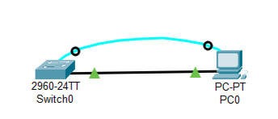

# Лабораторная работа. Базовая настройка коммутатора 

### Топология 


### Таблица адресации 
| Устройство | Интерфейс | IP-адрес / префикс | 
|------------|-----------|--------------------|
| S1         | VLAN 1    | 192.168.1.2 /24    |
| PC-A       | NIC       | 192.168.1.10 /24   |

###  Задачи:

  Часть 1. Проверка конфигурации коммутатора по умолчанию
  
  Часть 2. Создание сети и настройка основных параметров устройства
  
•	Настройте базовые параметры коммутатора.

•	Настройте IP-адрес для ПК.

  Часть 3. Проверка сетевых подключений
  
•	Отобразите конфигурацию устройства.

•	Протестируйте сквозное соединение, отправив эхо-запрос.

•	Протестируйте возможности удаленного управления с помощью Telnet.


###  Решение:
###Часть 1:

  

###  1. Задокументируем требуемые изменения в статической маршрутизации.


  Таблица статических маршрутов.

| Eq  | Prot | Destination              | Gateway                | M | Comment (name)                       |
|-----|------|--------------------------|------------------------|---|--------------------------------------|
| R1  | IPv4 | 0.0.0.0/0                | 172.16.19.1            | 1 | to R19 (ISP)                         |
| R1  | IPv6 | ::/0                     | 20FF:CCFF:1000:19::1   | 1 | to R19 (ISP)                         |
| R5  | IPv4 | 0.0.0.0/0                | 172.16.17.1            | 1 | to R17 (ISP)                         |
| R5  | IPv6 | ::/0                     | 20FF:CCFF:1000:17::1   | 1 | to R17 (ISP)                         |
| R9  | IPv4 | 0.0.0.0/0                | 172.16.18.1            | 1 | to R18 (ISP)                         |
| R9  | IPv6 | ::/0                     | 20FF:CCFF:1000:18::1   | 1 | to R18 (ISP)                         |
| R13 | IPv4 | 0.0.0.0/0                | 172.16.20.1            | 1 | to R20 (ISP)                         |
| R13 | IPv6 | ::/0                     | 20FF:CCFF:1000:20::1   | 1 | to R20 (ISP)                         |
| R17 | IPv4 | 172.16.18.0/29           | 90.90.129.18/24        | 1 | to R18                               |
| R17 | IPv4 | 172.16.19.0/30           | 90.90.128.19/24        | 1 | to R19                               |
| R17 | IPv4 | 172.16.20.0/30           | 90.90.131.20/25        | 1 | to R20                               |
| R17 | IPv6 | 20FF:CCFF:1000:18::/64   | 20FF:CCFF:FFFF:2::18   | 1 | to R18                               |
| R17 | IPv6 | 20FF:CCFF:1000:19::/64   | 20FF:CCFF:FFFF:1::19   | 1 | to R19                               |
| R17 | IPv6 | 20FF:CCFF:1000:20::/64   | 20FF:CCFF:FFFF:5::20   | 1 | to R20                               |
| R18 | IPv4 | 172.16.17.0/30           | 90.90.129.17/24        | 1 | to R17                               |
| R18 | IPv4 | 172.16.19.0/30           | 90.90.131.130/25       | 1 | to R19                               |
| R18 | IPv4 | 172.16.20.0/30           | 90.90.130.20/25        | 1 | to R20                               |
| R18 | IPv6 | 20FF:CCFF:1000:17::/64   | 20FF:CCFF:FFFF:2::17   | 1 | to R17                               |
| R18 | IPv6 | 20FF:CCFF:1000:19::/64   | 20FF:CCFF:FFFF:6::19   | 1 | to R19                               |
| R18 | IPv6 | 20FF:CCFF:1000:20::/64   | 20FF:CCFF:FFFF:3::20   | 1 | to R20                               |
| R19 | IPv4 | 172.16.17.0/30           | 90.90.128.17/24        | 1 | to R17                               |
| R19 | IPv4 | 172.16.18.0/29           | 90.90.131.129/25       | 1 | to R18                               |
| R19 | IPv4 | 172.16.20.0/30           | 90.90.130.130/25       | 1 | to R20                               |
| R19 | IPv6 | 20FF:CCFF:1000:17::/64   | 20FF:CCFF:FFFF:1::17   | 1 | to R17                               |
| R19 | IPv6 | 20FF:CCFF:1000:18::/64   | 20FF:CCFF:FFFF:6::18   | 1 | to R18                               |
| R19 | IPv6 | 20FF:CCFF:1000:20::/64   | 20FF:CCFF:FFFF:4::20   | 1 | to R20                               |
| R20 | IPv4 | 172.16.17.0/30           | 90.90.131.17/25        | 1 | to R17                               |
| R20 | IPv4 | 172.16.18.0/29           | 90.90.130.18/25        | 1 | to R18                               |
| R20 | IPv4 | 172.16.19.0/30           | 90.90.130.129/25       | 1 | to R19                               |
| R20 | IPv6 | 20FF:CCFF:1000:17::/64   | 20FF:CCFF:FFFF:5::17   | 1 | to R17                               |
| R20 | IPv6 | 20FF:CCFF:1000:18::/64   | 20FF:CCFF:FFFF:3::18   | 1 | to R18                               |
| R20 | IPv6 | 20FF:CCFF:1000:19::/64   | 20FF:CCFF:FFFF:4::19   | 1 | to R19                               |

###  Графическая схема статических маршрутов:


### Пример настройки статического маршрута

```
conf t
 ip route 0.0.0.0 0.0.0.0 172.16.19.1 1 name "to R19 (ISP)"
 ipv6 route ::/0 20FF:CCFF:1000:19::1 1 name "to R19 (ISP)"
 exit
```

### Просмотр настроенных статических маршрутов

```
show ip route static
show ipv6 route static
```

Полные файлы изменений приведены [здесь](configs/).

###  2. Маршрутизация на основе политик (Policy-based routing).

Маршрутизация на основе политик (policy based routing, PBR) позволяет маршрутизировать трафик на основании заданных политик,
 тогда как в обычной маршрутизации, только IP-адрес получателя определяет каким образом будет передан пакет. 

###  Графическая схема PBR по заданию:


Суть настройки в данном случае сводится к созданию корректного access-list,
 привязке его к соответствующему route-map, который впоследствии навешивается на интерфейс.   

###  Пример настройки PBR

```
conf t
 ip access-list extended ACL_PBR_TO_R13
  permit ip any host 172.16.20.2
  deny ip any any
  exit
!
 route-map PBR_TO_R13_AND_R5 permit 10
  match ip address ACL_PBR_TO_R13
  set ip next-hop 90.90.131.129
  exit
!
 interface e0/0
  ip policy route-map PBR_TO_R13_AND_R5
  exit
 exit
```

###  Просмотр настроек и результатов работы PBR

```
show access-lists
show route-map
show ip policy
show ipv6 policy
```

###  3. IP SLA

Суть в привязке тестов IP SLA к route-map. Применяется route-map или нет теперь будет зависеть от результатов тестирования.

###  Пример настройки PBR с IP SLA

```
conf t
 ip access-list extended ACL_PBR_TO_R13
  permit ip any host 172.16.20.2
  deny ip any any
  exit
!
 ip sla 1
  icmp-echo 90.90.131.129 source-interface e0/3
  threshold 1000
  timeout 1500
  frequency 3
  exit
 ip sla schedule 1 life forever start-time now
!
 track 100 ip sla 1 reachability
  delay down 10 up 5
  exit
!
 route-map PBR_TO_R13_AND_R5 permit 10
  match ip address ACL_PBR_TO_R13
  set ip next-hop 90.90.131.129
  set ip next-hop verify-availability 90.90.131.129 1 track 100
  exit
!
 interface e0/0
  ip policy route-map PBR_TO_R13_AND_R5
  exit
 exit
```

###  Просмотр настроек и результатов работы IP SLA

```
sh run | s sla
sh ip sla summary
sh ip sla statistics
```

Файл изменений на R19 [здесь](configs/R19).
